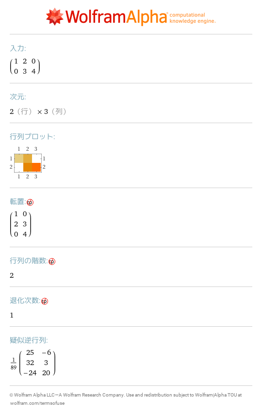
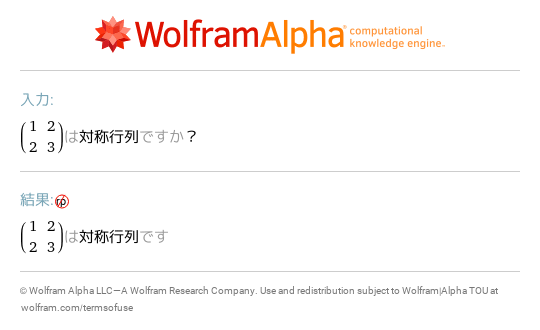
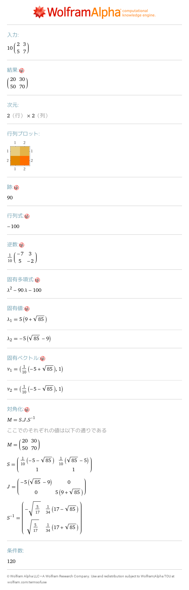
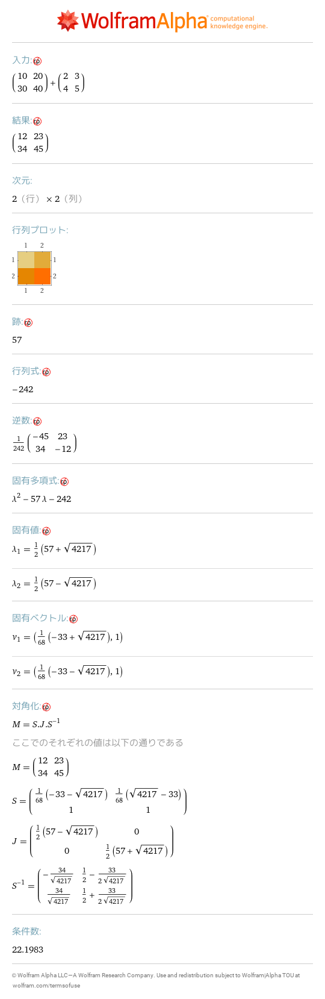
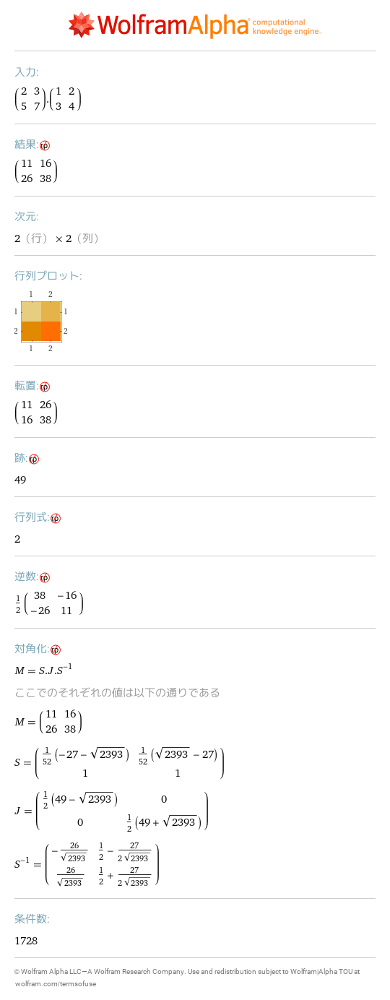
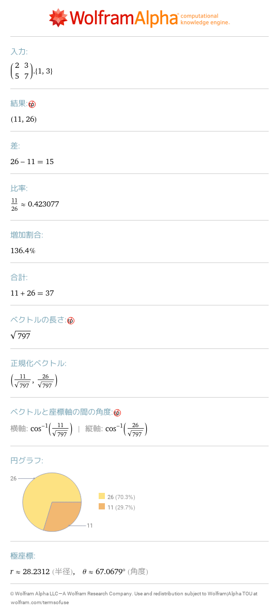
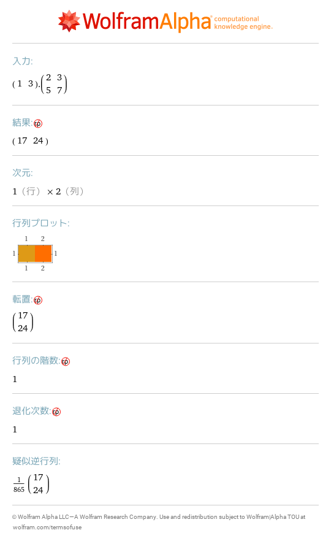
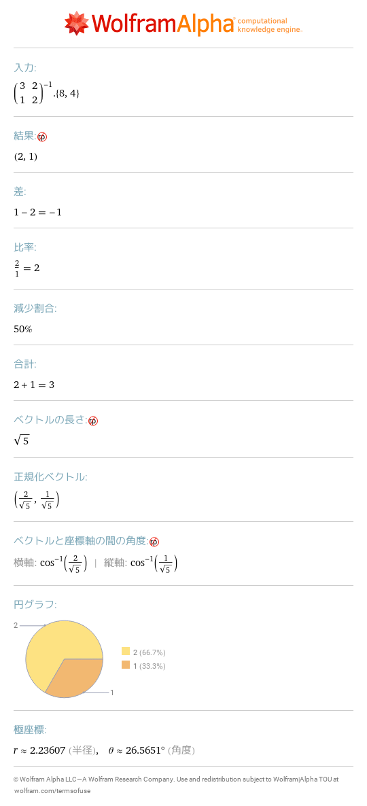
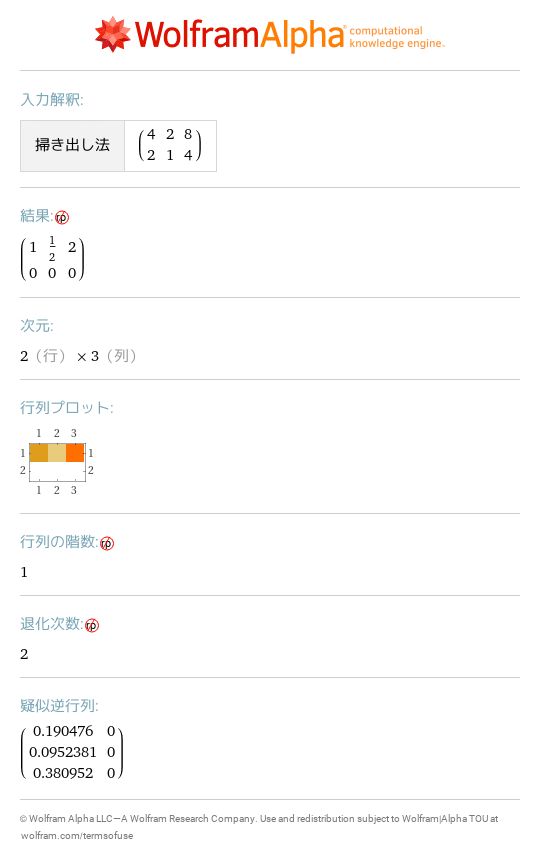

# 17 行列
- [\{\{1,2,0\},\{0,3,4\}\}](https://www.wolframalpha.com/input?i=%7B%7B1%2C2%2C0%7D%2C%7B0%2C3%2C4%7D%7D) 
- [symmetric matrix \{\{1,2\},\{2,3\}\}](https://www.wolframalpha.com/input?i=symmetric%20matrix%20%7B%7B1%2C2%7D%2C%7B2%2C3%7D%7D) 
- [10 \{\{2,3\},\{5,7\}\}](https://www.wolframalpha.com/input?i=10%20%7B%7B2%2C3%7D%2C%7B5%2C7%7D%7D) 
- [\{\{10,20\},\{30,40\}\}\+\{\{2,3\},\{4,5\}\}](https://www.wolframalpha.com/input?i=%7B%7B10%2C20%7D%2C%7B30%2C40%7D%7D%2B%7B%7B2%2C3%7D%2C%7B4%2C5%7D%7D) 
- [\{\{2,3\},\{5,7\}\}\.\{\{1,2\},\{3,4\}\}](https://www.wolframalpha.com/input?i=%7B%7B2%2C3%7D%2C%7B5%2C7%7D%7D.%7B%7B1%2C2%7D%2C%7B3%2C4%7D%7D) 
- [\{\{2,3\},\{5,7\}\}\.\{1,3\}](https://www.wolframalpha.com/input?i=%7B%7B2%2C3%7D%2C%7B5%2C7%7D%7D.%7B1%2C3%7D) 
- [\{1,3\}\.\{\{2,3\},\{5,7\}\}](https://www.wolframalpha.com/input?i=%7B1%2C3%7D.%7B%7B2%2C3%7D%2C%7B5%2C7%7D%7D) 
- [\(inverse \{\{3,2\},\{1,2\}\}\)\.\{8, 4\}](https://www.wolframalpha.com/input?i=%28inverse%20%7B%7B3%2C2%7D%2C%7B1%2C2%7D%7D%29.%7B8%2C%204%7D) 
- [row reduce \{\{4,2,8\},\{2,1,4\}\}](https://www.wolframalpha.com/input?i=row%20reduce%20%7B%7B4%2C2%2C8%7D%2C%7B2%2C1%2C4%7D%7D) 
