# 2 数と変数
- [2 \* \(\-3\)](https://www.wolframalpha.com/input?i=2%20%2A%20%28-3%29) 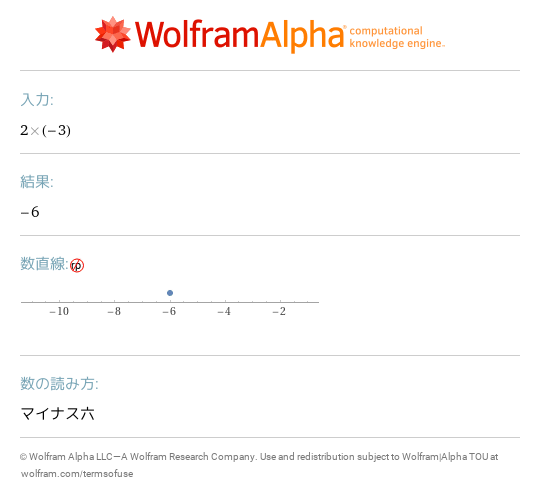
- [2 \(\-3\)](https://www.wolframalpha.com/input?i=2%20%28-3%29) 
- [\(1 \+ 2\) \* 3](https://www.wolframalpha.com/input?i=%281%20%2B%202%29%20%2A%203) 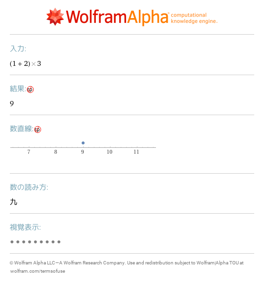
- [2^10](https://www.wolframalpha.com/input?i=2%5E10) 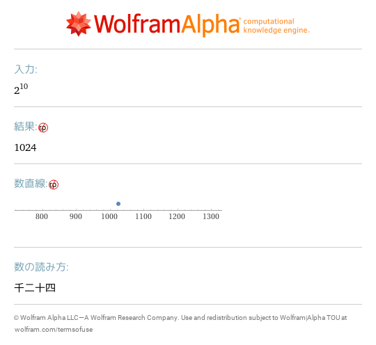
- [2\*\*10](https://www.wolframalpha.com/input?i=2%2A%2A10) 
- [\-2 < \-1](https://www.wolframalpha.com/input?i=-2%20%3C%20-1) 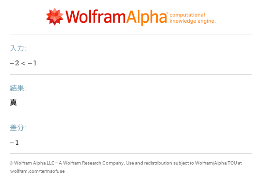
- [2 \+ 2 == 5](https://www.wolframalpha.com/input?i=2%20%2B%202%20%3D%3D%205) 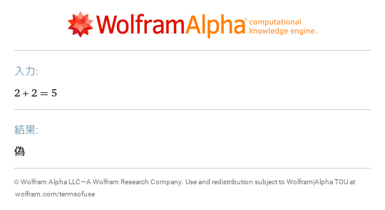
- [x<1](https://www.wolframalpha.com/input?i=x%3C1) 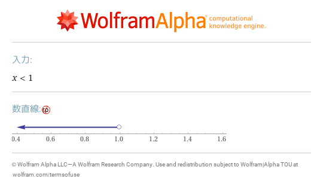
- [not \(0 < 1\)](https://www.wolframalpha.com/input?i=not%20%280%20%3C%201%29) 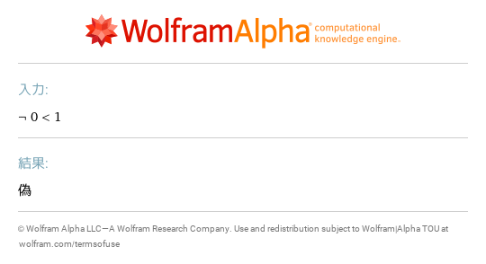
- [\(0 < 1\) or \(2 > 3\)](https://www.wolframalpha.com/input?i=%280%20%3C%201%29%20or%20%282%20%3E%203%29) 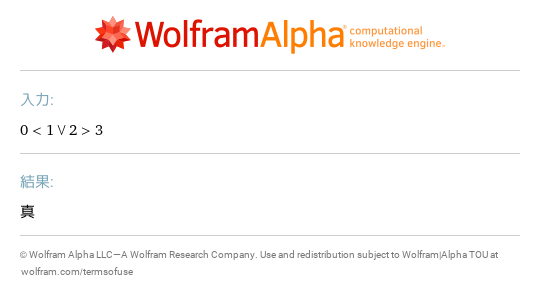
- [\(0 < 1\) and \(2 > 3\)](https://www.wolframalpha.com/input?i=%280%20%3C%201%29%20and%20%282%20%3E%203%29) 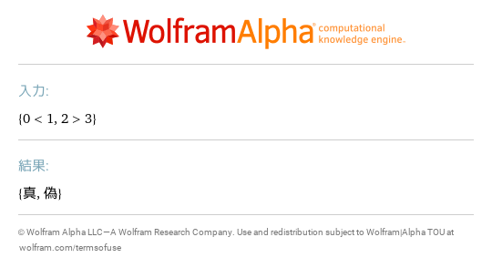
- [Not\[10<x\]](https://www.wolframalpha.com/input?i=Not%5B10%3Cx%5D) ![Not\[10<x\]](12.png)
- [x==5 where x=5](https://www.wolframalpha.com/input?i=x%3D%3D5%20where%20x%3D5) 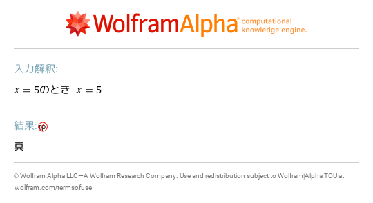
- [a \(b\+1\) where a=1\+2,b=9](https://www.wolframalpha.com/input?i=a%20%28b%2B1%29%20where%20a%3D1%2B2%2Cb%3D9) 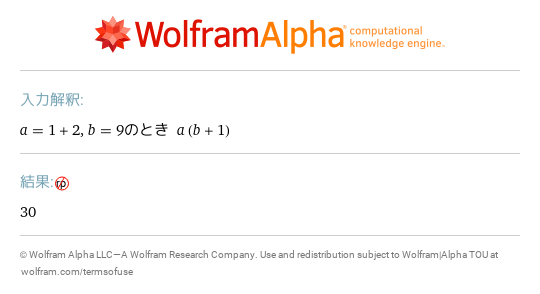
- [a = 1 \+ 2; b = 9; a \* \(b \+ 1\)](https://www.wolframalpha.com/input?i=a%20%3D%201%20%2B%202%3B%20b%20%3D%209%3B%20a%20%2A%20%28b%20%2B%201%29) 
- [x1 = 2; x2 = 3; x1 \+ x2](https://www.wolframalpha.com/input?i=x1%20%3D%202%3B%20x2%20%3D%203%3B%20x1%20%2B%20x2) 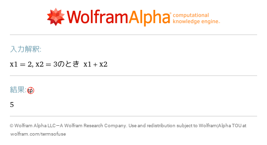
- [f\(2,3\) where f\(x,y\)=x\+y](https://www.wolframalpha.com/input?i=f%282%2C3%29%20where%20f%28x%2Cy%29%3Dx%2By) 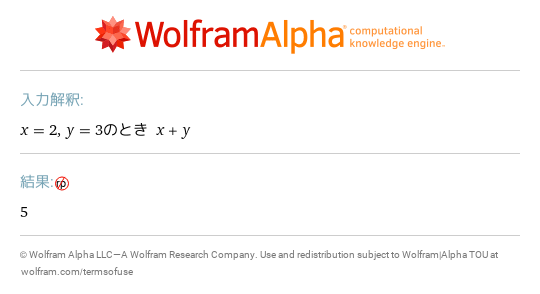
- [g\(x\) where x=\{2,3\}, g\(x\)=x\[\[1\]\]\+x\[\[2\]\]](https://www.wolframalpha.com/input?i=g%28x%29%20where%20x%3D%7B2%2C3%7D%2C%20g%28x%29%3Dx%5B%5B1%5D%5D%2Bx%5B%5B2%5D%5D) ![g\(x\) where x=\{2,3\}, g\(x\)=x\[\[1\]\]\+x\[\[2\]\]](18.png)
- [0\.1 \+ 0\.1 \+ 0\.1 == 0\.3](https://www.wolframalpha.com/input?i=0.1%20%2B%200.1%20%2B%200.1%20%3D%3D%200.3) 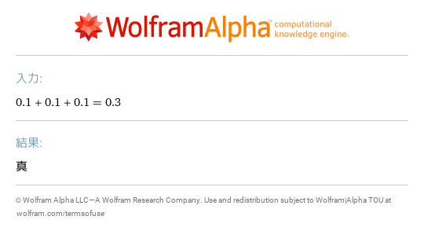
- [1/10 \+ 1/10 \+ 1/10](https://www.wolframalpha.com/input?i=1%2F10%20%2B%201%2F10%20%2B%201%2F10) 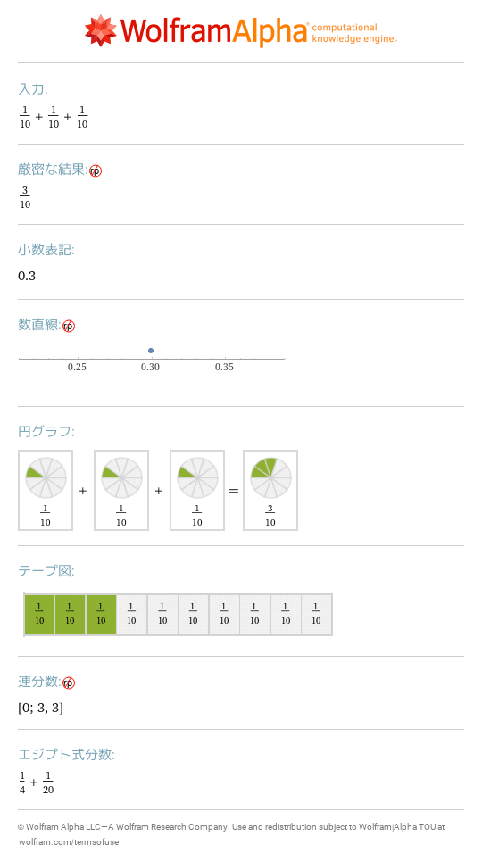
