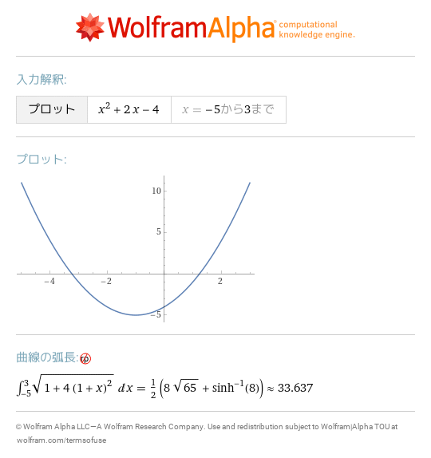
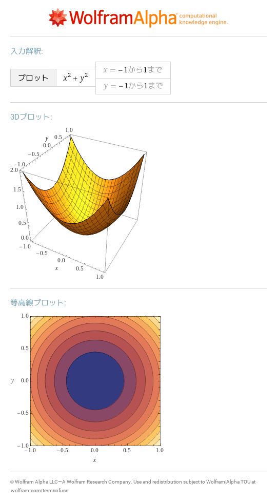
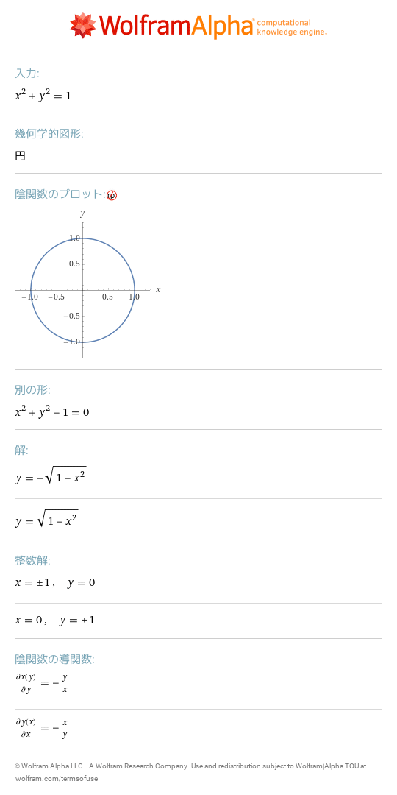
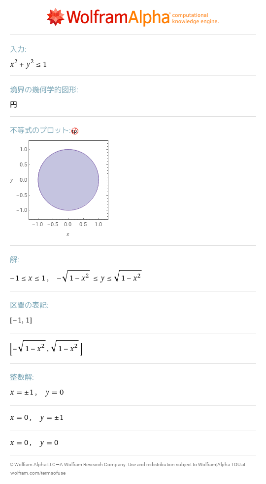
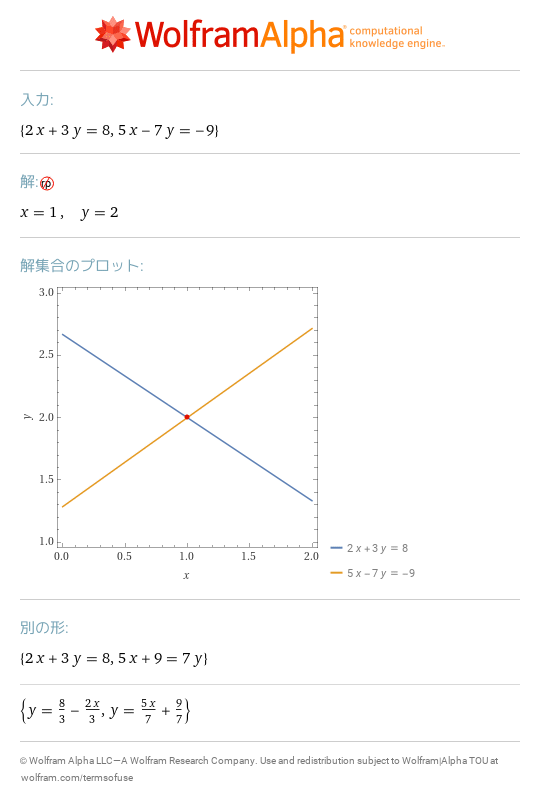
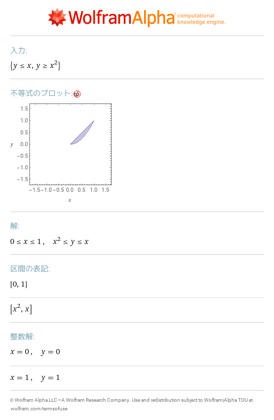
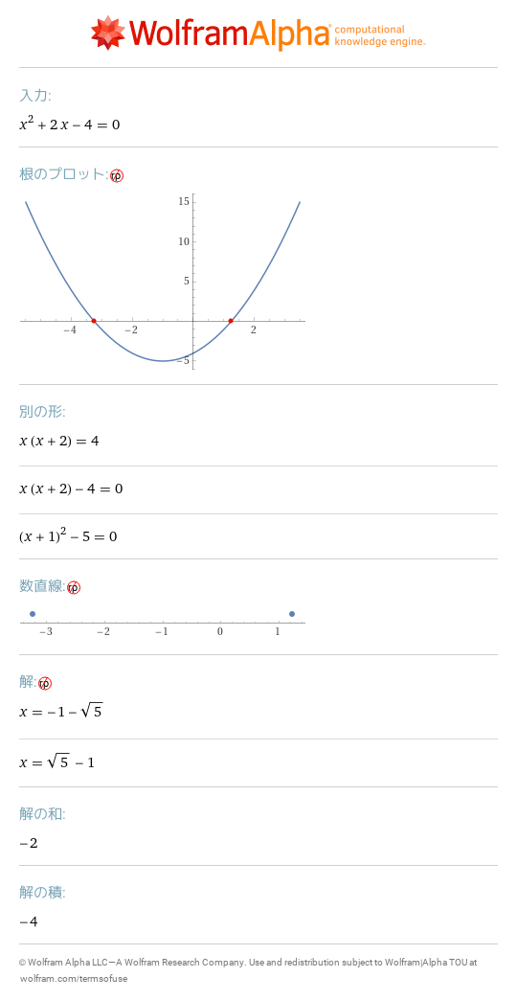
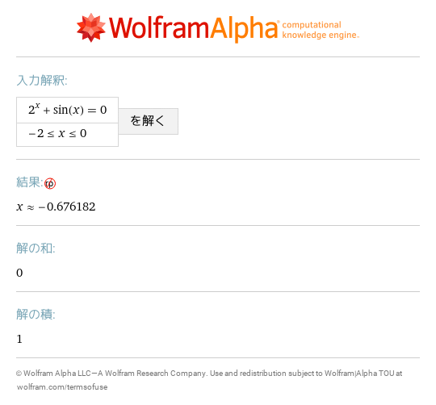
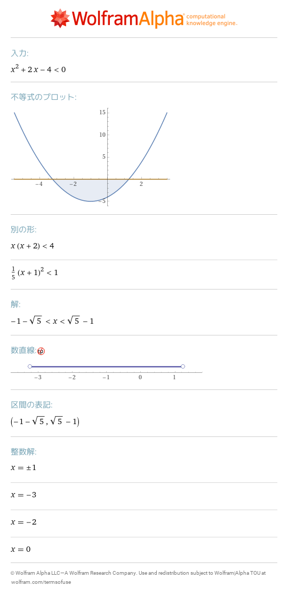

# 4 可視化と方程式
- [plot x^2\+2x\-4,x=\-5\.\.3](https://www.wolframalpha.com/input?i=plot%2Bx%5E2%2B2x-4%2Cx%3D-5..3) 
- [plot x^2\+y^2,x=\-1\.\.1,y=\-1\.\.1](https://www.wolframalpha.com/input?i=plot%2Bx%5E2%2By%5E2%2Cx%3D-1..1%2Cy%3D-1..1) 
- [x^2\+y^2=1](https://www.wolframalpha.com/input?i=x%5E2%2By%5E2%3D1) 
- [x^2\+y^2<=1](https://www.wolframalpha.com/input?i=x%5E2%2By%5E2%3C%3D1) 
- [2x\+3y=8,5x\-7y=\-9](https://www.wolframalpha.com/input?i=2x%2B3y%3D8%2C5x-7y%3D-9) 
- [y<=x and y>=x^2](https://www.wolframalpha.com/input?i=y%3C%3Dx%2Band%2By%3E%3Dx%5E2) 
- [x2\+2x\-4=0](https://www.wolframalpha.com/input?i=x2%2B2x-4%3D0) 
- [2x\+3y=8,5x\-7y=\-9](https://www.wolframalpha.com/input?i=2x%2B3y%3D8%2C5x-7y%3D-9) 
- [solve 2^x\+sin x=0 for x=\-2\.\.0](https://www.wolframalpha.com/input?i=solve%2B2%5Ex%2Bsin%2Bx%3D0%2Bfor%2Bx%3D-2..0) 
- [x^2\+2x\-4<0](https://www.wolframalpha.com/input?i=x%5E2%2B2x-4%3C0) 
