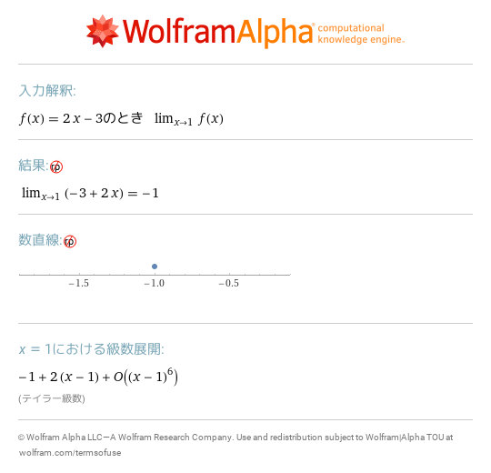
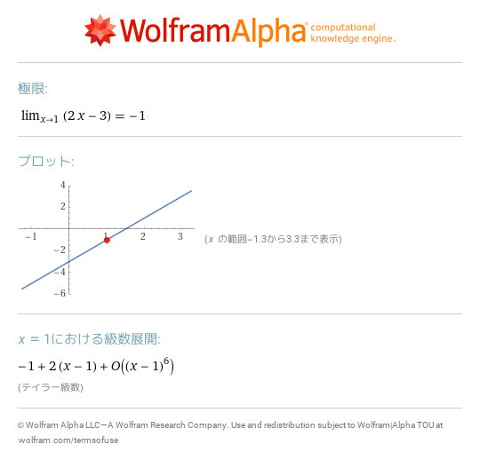
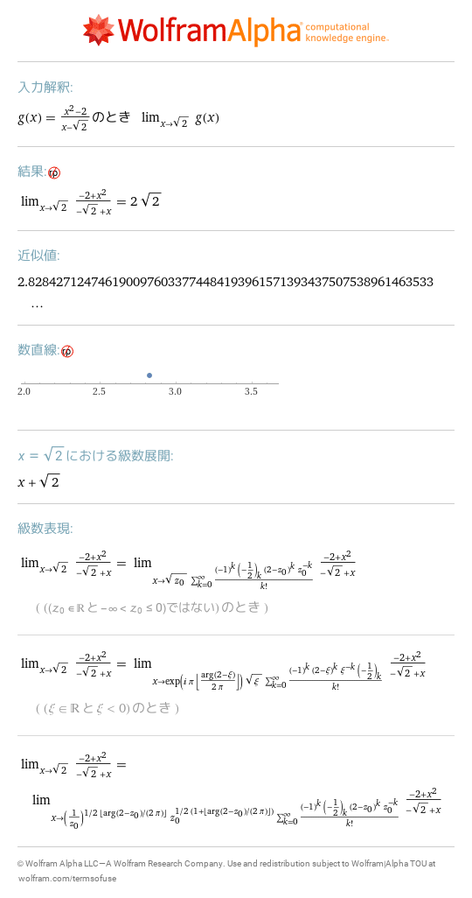
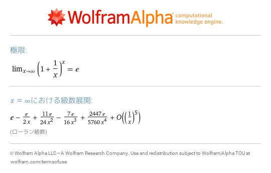
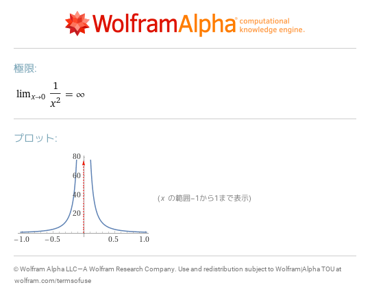
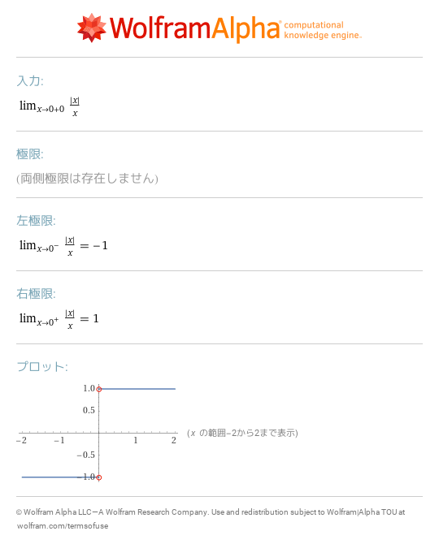

# 12 関数の極限と連続性
- [lim f\(x\) as x\->1 where f\(x\)=2x\-3](https://www.wolframalpha.com/input?i=lim%2Bf%28x%29%2Bas%2Bx-%3E1%2Bwhere%2Bf%28x%29%3D2x-3) 
- [lim 2x\-3 as x\->1](https://www.wolframalpha.com/input?i=lim%2B2x-3%2Bas%2Bx-%3E1) 
- [lim g\(x\) as x\->sqrt\(2\) where g\(x\)=\(x^2\-2\)/\(x\-sqrt\(2\)\)](https://www.wolframalpha.com/input?i=lim%2Bg%28x%29%2Bas%2Bx-%3Esqrt%282%29%2Bwhere%2Bg%28x%29%3D%28x%5E2-2%29%2F%28x-sqrt%282%29%29) 
- [limit \(1\+1/x\)^x as x\->infinity](https://www.wolframalpha.com/input?i=limit%2B%281%2B1%2Fx%29%5Ex%2Bas%2Bx-%3Einfinity) 
- [limit 1/x^2 as x\->0](https://www.wolframalpha.com/input?i=limit%2B1%2Fx%5E2%2Bas%2Bx-%3E0) 
- [lim \|x\|/x as x\->0\+0](https://www.wolframalpha.com/input?i=lim%2B%7Cx%7C%2Fx%2Bas%2Bx-%3E0%2B0) 
