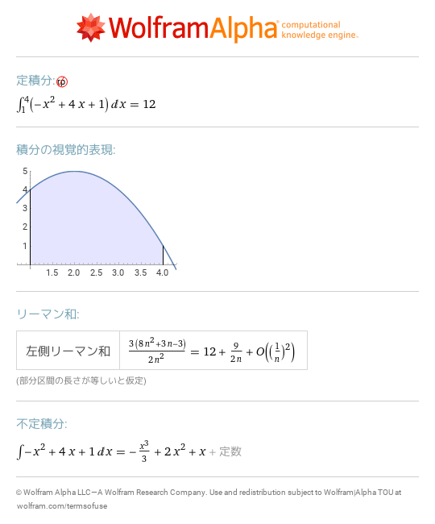
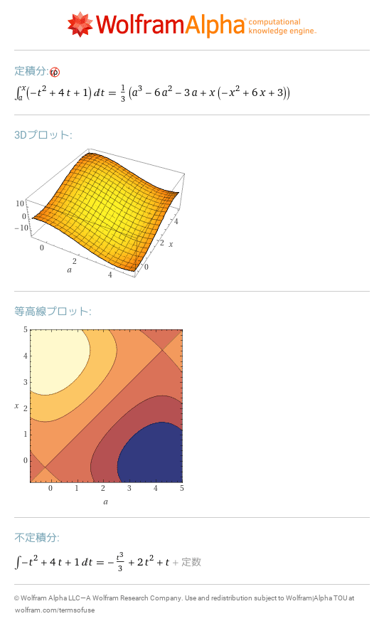
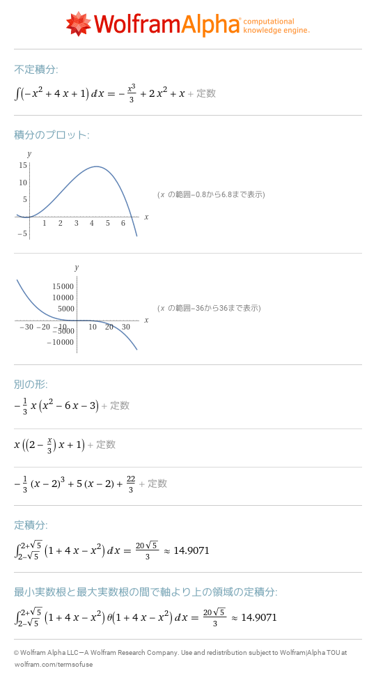
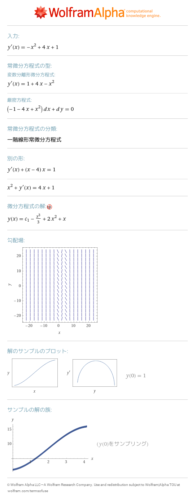
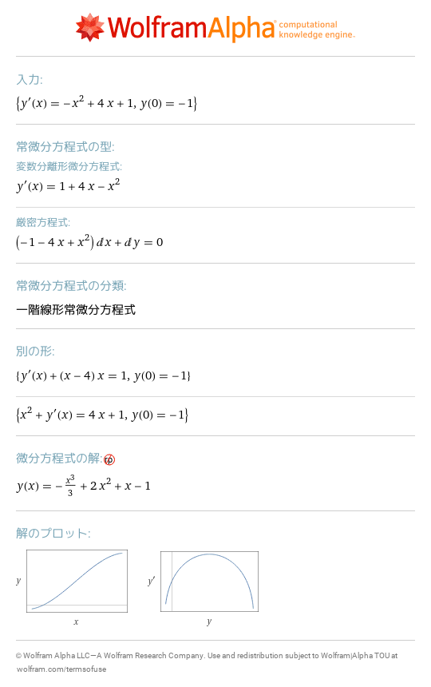
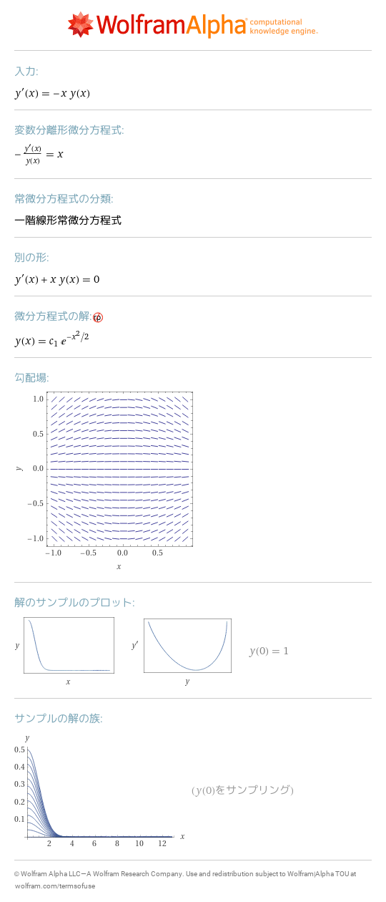
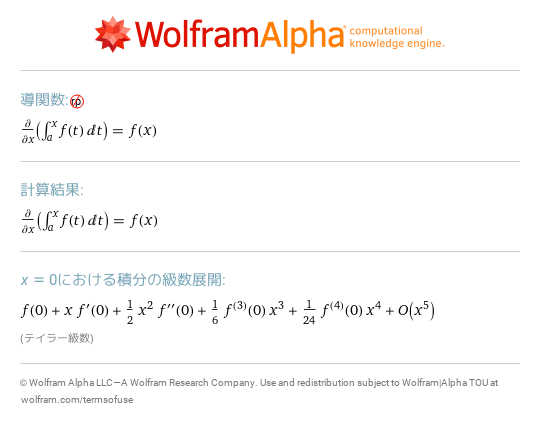
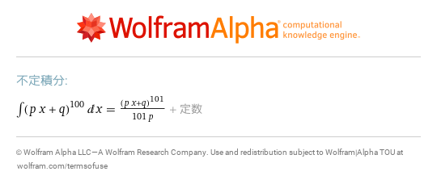
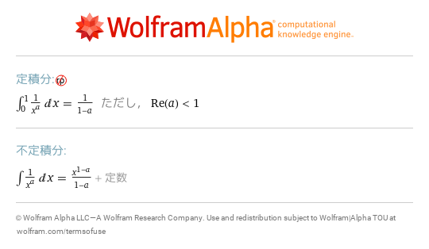
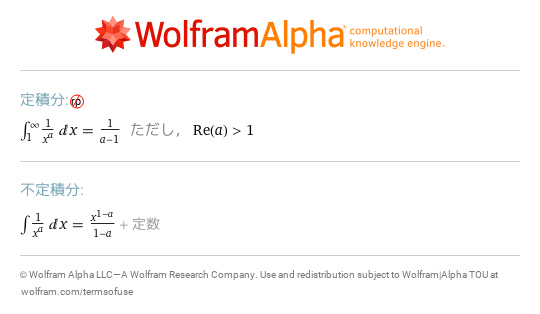

# 14 積分
- [integral\_1^4 \(\-x^2\+4x\+1\) dx](https://www.wolframalpha.com/input?i=integral_1%5E4%20%28-x%5E2%2B4x%2B1%29%20dx) 
- [integral\_a^x \-x^2\+4x\+1 dx](https://www.wolframalpha.com/input?i=integral_a%5Ex%20-x%5E2%2B4x%2B1%20dx) 
- [integral \-x^2\+4x\+1 dx](https://www.wolframalpha.com/input?i=integral%20-x%5E2%2B4x%2B1%20dx) 
- [y'\(x\)=\-x^2\+4x\+1](https://www.wolframalpha.com/input?i=y%27%28x%29%3D-x%5E2%2B4x%2B1) 
- [y'\(x\)=\-x^2\+4x\+1,y\(0\)=\-1](https://www.wolframalpha.com/input?i=y%27%28x%29%3D-x%5E2%2B4x%2B1%2Cy%280%29%3D-1) 
- [y'\(x\)=\-x y\(x\)](https://www.wolframalpha.com/input?i=y%27%28x%29%3D-x%20y%28x%29) 
- [d/dx\(integral\_a^x f\(t\)dt\)](https://www.wolframalpha.com/input?i=d%2Fdx%28integral_a%5Ex%20f%28t%29dt%29) 
- [integral \(p x\+q\)^100 dx](https://www.wolframalpha.com/input?i=integral%20%28p%20x%2Bq%29%5E100%20dx) 
- [int 1/x^a x=0\.\.1](https://www.wolframalpha.com/input?i=int%201%2Fx%5Ea%20x%3D0..1) 
- [int 1/x^a x=1\.\.infinity](https://www.wolframalpha.com/input?i=int%201%2Fx%5Ea%20x%3D1..infinity) 
