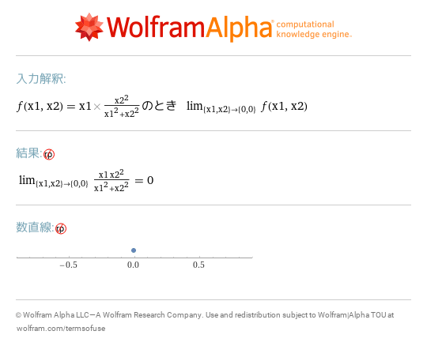
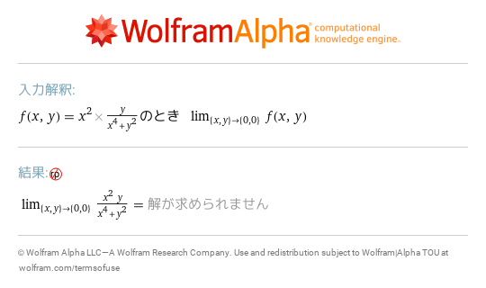
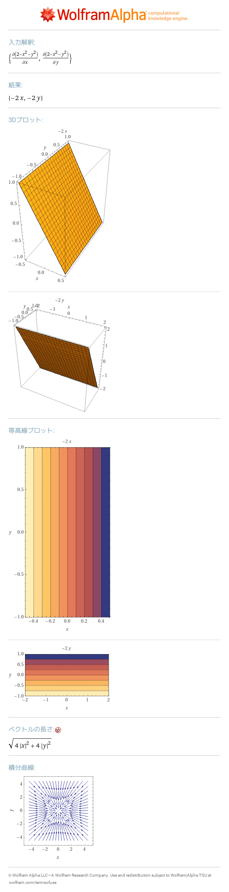
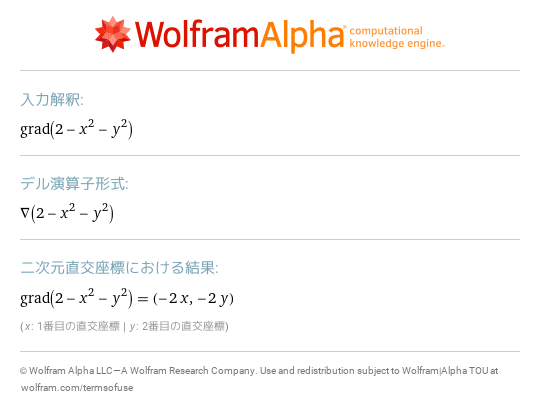
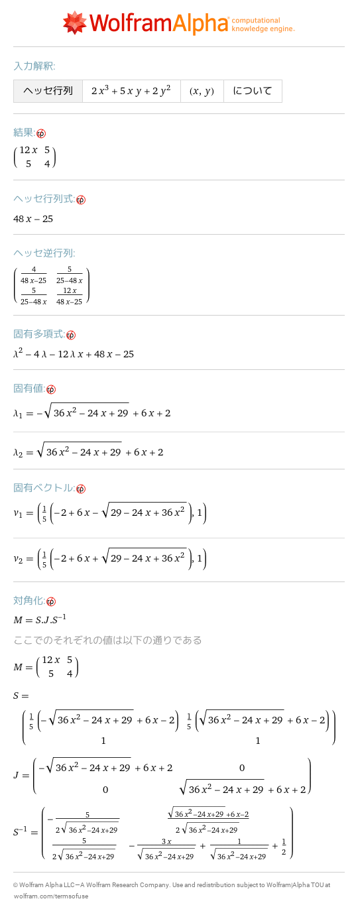
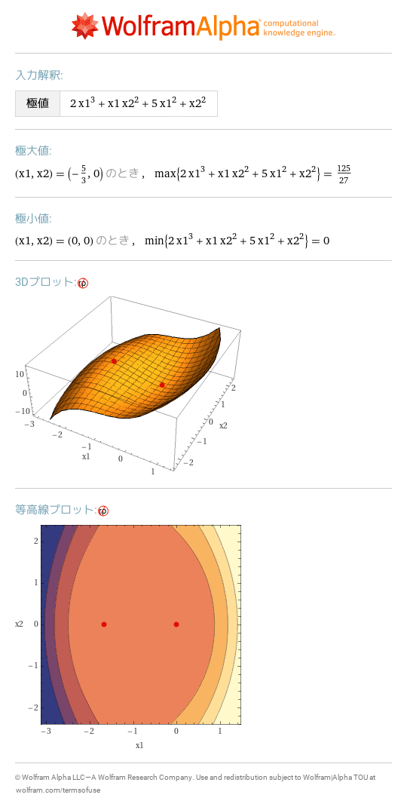
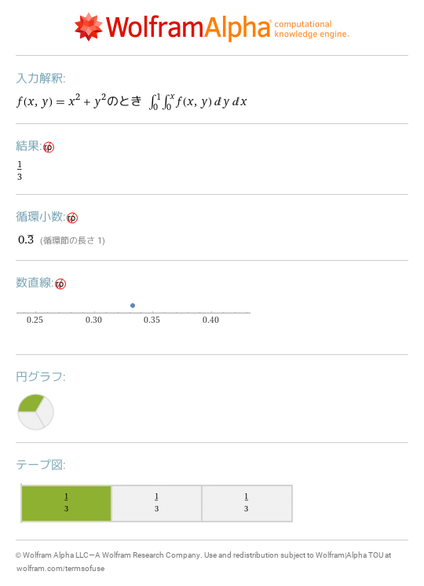

# 15 多変数関数の微分積分
- [lim f\(x1,x2\) as \(x1,x2\)\->\(0,0\) where f\(x1,x2\)=x1 x2^2/\(x1^2\+x2^2\)](https://www.wolframalpha.com/input?i=lim%2Bf%28x1%2Cx2%29%2Bas%2B%28x1%2Cx2%29-%3E%280%2C0%29%2Bwhere%2Bf%28x1%2Cx2%29%3Dx1%2Bx2%5E2%2F%28x1%5E2%2Bx2%5E2%29) 
- [lim f\(x,y\) as \(x,y\)\->\(0,0\) where f\(x,y\)=x^2 y/\(x^4\+y^2\)](https://www.wolframalpha.com/input?i=lim%2Bf%28x%2Cy%29%2Bas%2B%28x%2Cy%29-%3E%280%2C0%29%2Bwhere%2Bf%28x%2Cy%29%3Dx%5E2%2By%2F%28x%5E4%2By%5E2%29) 
- [d/dx 2\-x^2\-y^2,d/dy 2\-x^2\-y^2](https://www.wolframalpha.com/input?i=d%2Fdx%2B2-x%5E2-y%5E2%2Cd%2Fdy%2B2-x%5E2-y%5E2) 
- [grad\(2\-x^2\-y^2\)](https://www.wolframalpha.com/input?i=grad%282-x%5E2-y%5E2%29) 
- [hessian matrix of 2x^3\+5xy\+2y^2](https://www.wolframalpha.com/input?i=hessian%2Bmatrix%2Bof%2B2x%5E3%2B5xy%2B2y%5E2) 
- [local extrema of 2x1^3\+x1 x2^2\+5x1^2\+x2^2](https://www.wolframalpha.com/input?i=local%2Bextrema%2Bof%2B2x1%5E3%2Bx1%2Bx2%5E2%2B5x1%5E2%2Bx2%5E2) 
- [integrate f\(x,y\) dy dx y=0\.\.x,x=0\.\.1 where f\(x,y\)=x^2\+y^2](https://www.wolframalpha.com/input?i=integrate%2Bf%28x%2Cy%29%2Bdy%2Bdx%2By%3D0..x%2Cx%3D0..1%2Bwhere%2Bf%28x%2Cy%29%3Dx%5E2%2By%5E2) 
- [integrate f\(x,y\) dx dy x=y\.\.1,y=0\.\.1 where f\(x,y\)=x^2\+y^2](https://www.wolframalpha.com/input?i=integrate%2Bf%28x%2Cy%29%2Bdx%2Bdy%2Bx%3Dy..1%2Cy%3D0..1%2Bwhere%2Bf%28x%2Cy%29%3Dx%5E2%2By%5E2) 
