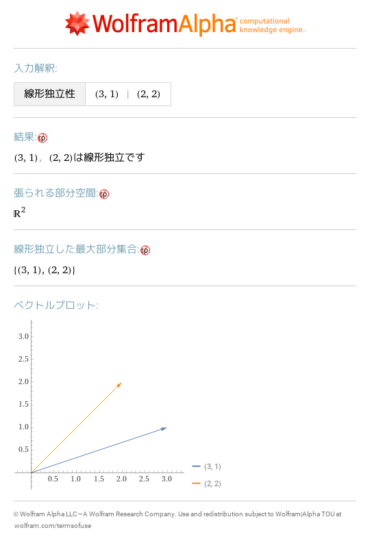
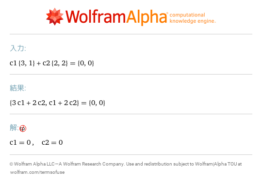
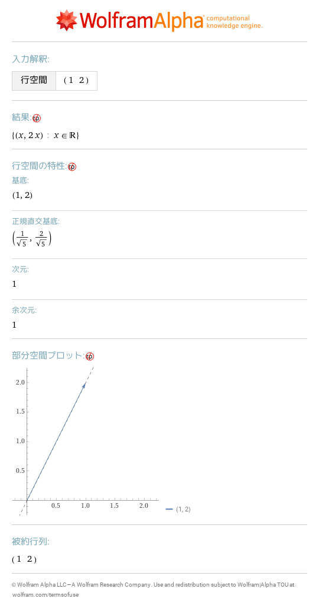
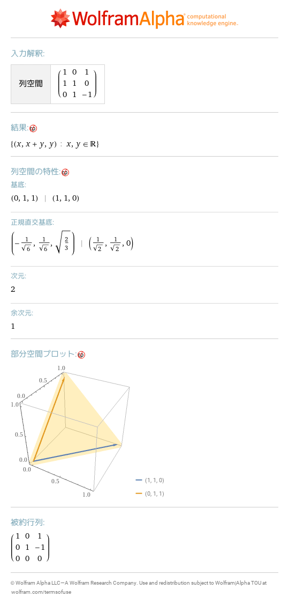
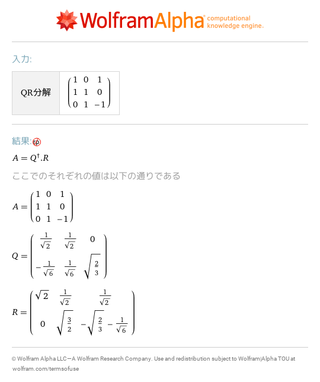
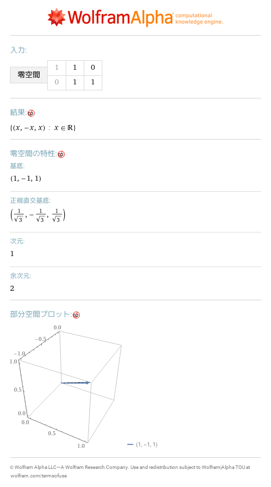

# 18 ベクトル空間
- [linear independence \{3,1\},\{2,2\}](https://www.wolframalpha.com/input?i=linear%2Bindependence%2B%7B3%2C1%7D%2C%7B2%2C2%7D) 
- [c1\{3,1\}\+c2\{2,2\}=\{0,0\}](https://www.wolframalpha.com/input?i=c1%7B3%2C1%7D%2Bc2%7B2%2C2%7D%3D%7B0%2C0%7D) 
- [row space \{\{1,2\}\}](https://www.wolframalpha.com/input?i=row%2Bspace%2B%7B%7B1%2C2%7D%7D) 
- [row space \{\{1,1,0\},\{0,1,1\}\}](https://www.wolframalpha.com/input?i=row%2Bspace%2B%7B%7B1%2C1%2C0%7D%2C%7B0%2C1%2C1%7D%7D) 
- [column space \{\{1,0,1\},\{1,1,0\},\{0,1,\-1\}\}](https://www.wolframalpha.com/input?i=column%2Bspace%2B%7B%7B1%2C0%2C1%7D%2C%7B1%2C1%2C0%7D%2C%7B0%2C1%2C-1%7D%7D) 
- [QR decomposition \{\{1,0,1\},\{1,1,0\},\{0,1,\-1\}\}](https://www.wolframalpha.com/input?i=QR%2Bdecomposition%2B%7B%7B1%2C0%2C1%7D%2C%7B1%2C1%2C0%7D%2C%7B0%2C1%2C-1%7D%7D) 
- [null space of transpose \{\{1,0\},\{1,1\},\{0,1\}\}](https://www.wolframalpha.com/input?i=null%2Bspace%2Bof%2Btranspose%2B%7B%7B1%2C0%7D%2C%7B1%2C1%7D%2C%7B0%2C1%7D%7D) 
