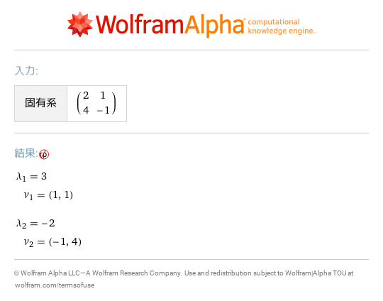
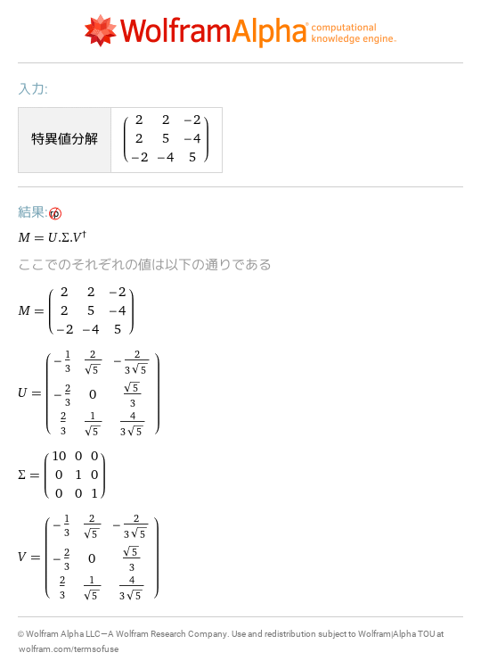
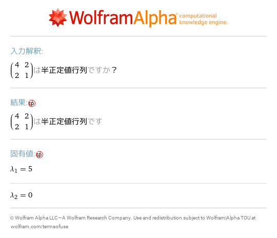
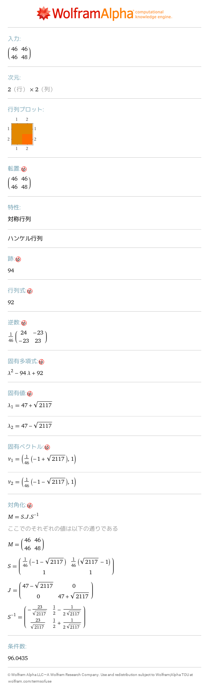
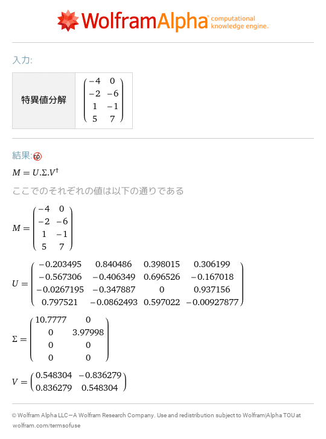

# 19 固有値と固有ベクトル
- [eigensystem \{\{2,1\},\{4,\-1\}\}](https://www.wolframalpha.com/input?i=eigensystem%20%7B%7B2%2C1%7D%2C%7B4%2C-1%7D%7D) 
- [solve det\(x IdentityMatrix\[2\]\-\{\{2,1\},\{4,\-1\}\}\)=0](https://www.wolframalpha.com/input?i=solve%20det%28x%20IdentityMatrix%5B2%5D-%7B%7B2%2C1%7D%2C%7B4%2C-1%7D%7D%29%3D0) ![solve det\(x IdentityMatrix\[2\]\-\{\{2,1\},\{4,\-1\}\}\)=0](02.png)
- [solve \(3 IdentityMatrix\[2\]\-\{\{2,1\},\{4,\-1\}\}\)\.\{x,y\}=\{0,0\}](https://www.wolframalpha.com/input?i=solve%20%283%20IdentityMatrix%5B2%5D-%7B%7B2%2C1%7D%2C%7B4%2C-1%7D%7D%29.%7Bx%2Cy%7D%3D%7B0%2C0%7D) ![solve \(3 IdentityMatrix\[2\]\-\{\{2,1\},\{4,\-1\}\}\)\.\{x,y\}=\{0,0\}](03.png)
- [svd \{\{2,2,\-2\}, \{2,5,\-4\}, \{\-2,\-4,5\}\}](https://www.wolframalpha.com/input?i=svd%20%7B%7B2%2C2%2C-2%7D%2C%20%7B2%2C5%2C-4%7D%2C%20%7B-2%2C-4%2C5%7D%7D) 
- [positive semidefinite \{\{4,2\},\{2,1\}\}](https://www.wolframalpha.com/input?i=positive%20semidefinite%20%7B%7B4%2C2%7D%2C%7B2%2C1%7D%7D) 
- [\{\{46,46\},\{46,48\}\}](https://www.wolframalpha.com/input?i=%7B%7B46%2C46%7D%2C%7B46%2C48%7D%7D) 
- [svd \{\{\-4,0\},\{\-2,\-6\},\{1,\-1\},\{5,7\}\}](https://www.wolframalpha.com/input?i=svd%20%7B%7B-4%2C0%7D%2C%7B-2%2C-6%7D%2C%7B1%2C-1%7D%2C%7B5%2C7%7D%7D) 
