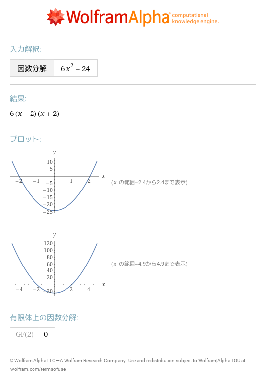

# 1 実行環境
- [factor 6x^2\-24](https://www.wolframalpha.com/input?i=factor%206x%5E2-24) 
- [6x^2\-24の因数分解](https://www.wolframalpha.com/input?i=6x%5E2-24%E3%81%AE%E5%9B%A0%E6%95%B0%E5%88%86%E8%A7%A3) 
