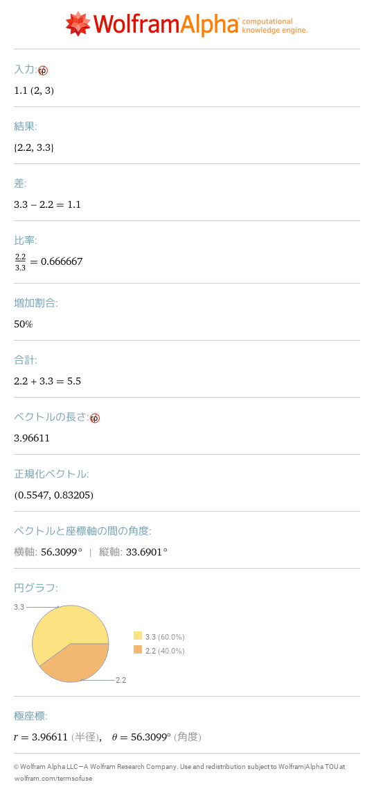
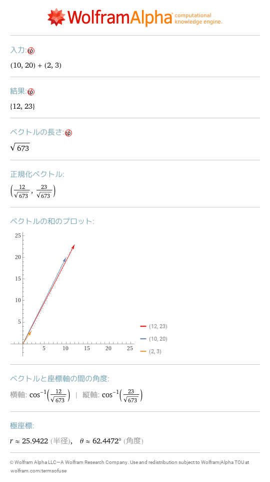
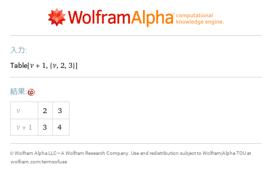
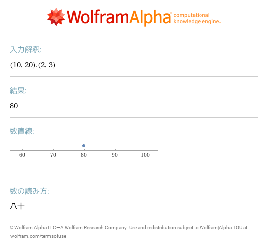

# 3 データ構造
- [1\.1\{2,3\}](https://www.wolframalpha.com/input?i=1.1%7B2%2C3%7D) 
- [\{10,20\}\+\{2,3\}](https://www.wolframalpha.com/input?i=%7B10%2C20%7D%2B%7B2%2C3%7D) 
- [v\+1 where v=\{2,3\}](https://www.wolframalpha.com/input?i=v%2B1%20where%20v%3D%7B2%2C3%7D) 
- [\{10,20\}\.\{2,3\}](https://www.wolframalpha.com/input?i=%7B10%2C20%7D.%7B2%2C3%7D) 
