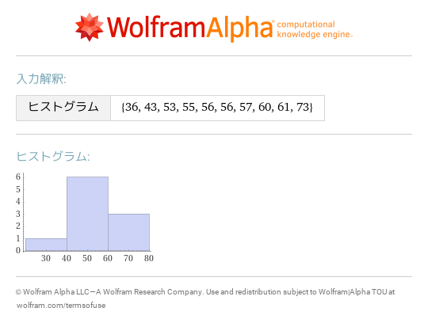
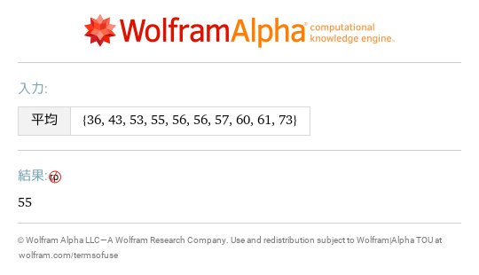
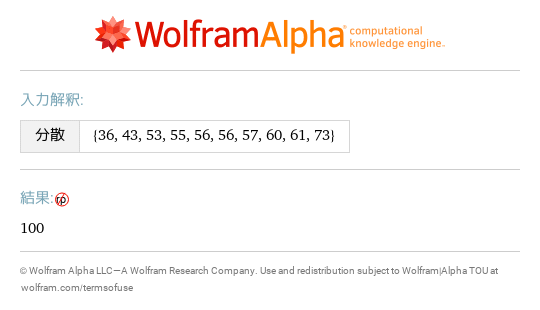
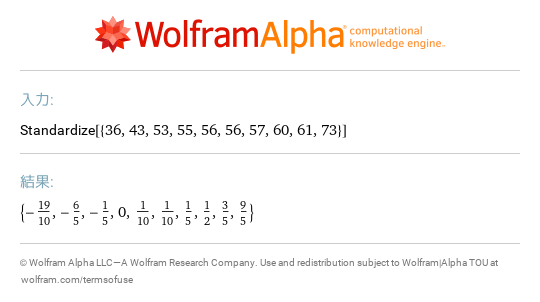

# 6 1次元のデータ
- [histogram \{36,43,53,55,56,56,57,60,61,73\}](https://www.wolframalpha.com/input?i=histogram%20%7B36%2C43%2C53%2C55%2C56%2C56%2C57%2C60%2C61%2C73%7D) 
- [mean \{36,43,53,55,56,56,57,60,61,73\}](https://www.wolframalpha.com/input?i=mean%20%7B36%2C43%2C53%2C55%2C56%2C56%2C57%2C60%2C61%2C73%7D) 
- [var \{36,43,53,55,56,56,57,60,61,73\}](https://www.wolframalpha.com/input?i=var%20%7B36%2C43%2C53%2C55%2C56%2C56%2C57%2C60%2C61%2C73%7D) 
- [standardize \{36,43,53,55,56,56,57,60,61,73\}](https://www.wolframalpha.com/input?i=standardize%20%7B36%2C43%2C53%2C55%2C56%2C56%2C57%2C60%2C61%2C73%7D) 
