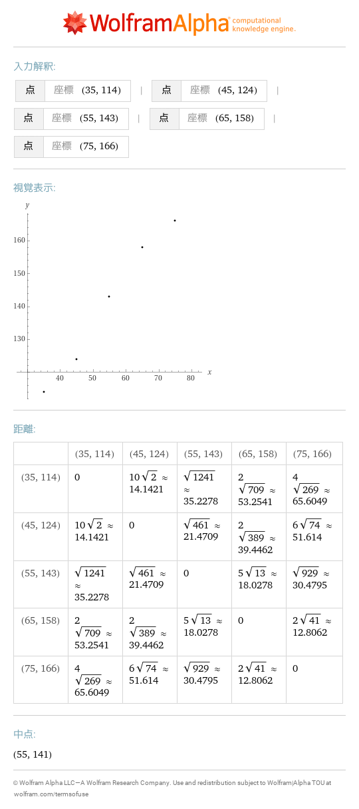
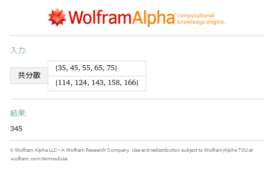
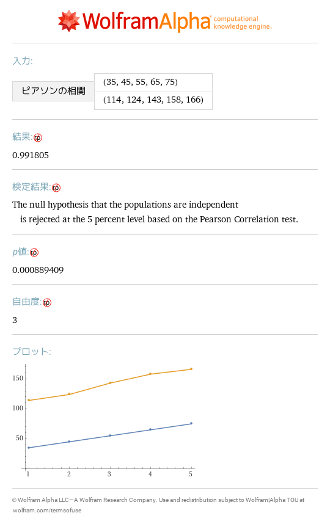
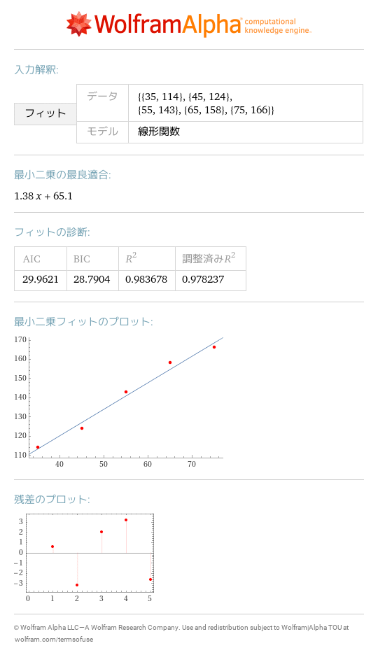

# 7 2次元のデータ
- [\{35,114\},\{45,124\},\{55,143\},\{65,158\},\{75,166\}](https://www.wolframalpha.com/input?i=%7B35%2C114%7D%2C%7B45%2C124%7D%2C%7B55%2C143%7D%2C%7B65%2C158%7D%2C%7B75%2C166%7D) 
- [covariance \{35,45,55,65,75\},\{114,124,143,158,166\}](https://www.wolframalpha.com/input?i=covariance%20%7B35%2C45%2C55%2C65%2C75%7D%2C%7B114%2C124%2C143%2C158%2C166%7D) 
- [correlation \{35,45,55,65,75\},\{114,124,143,158,166\}](https://www.wolframalpha.com/input?i=correlation%20%7B35%2C45%2C55%2C65%2C75%7D%2C%7B114%2C124%2C143%2C158%2C166%7D) 
- [linear fit \{35,114\},\{45,124\},\{55,143\},\{65,158\},\{75,166\}](https://www.wolframalpha.com/input?i=linear%20fit%20%7B35%2C114%7D%2C%7B45%2C124%7D%2C%7B55%2C143%7D%2C%7B65%2C158%7D%2C%7B75%2C166%7D) 
