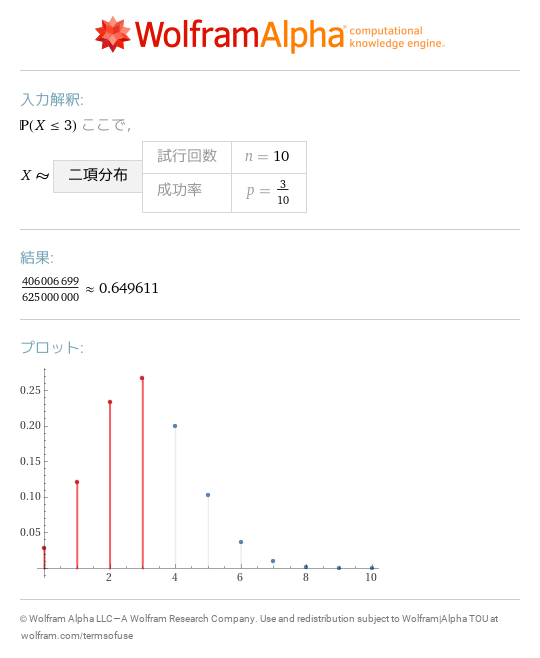
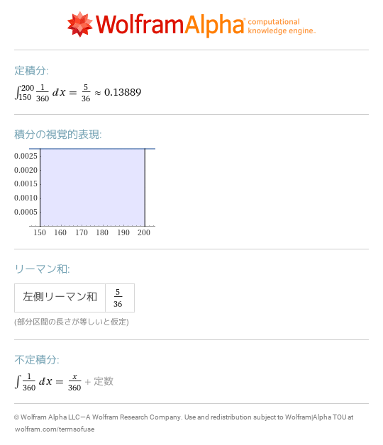

# 8 確率変数と確率分布
- [P\(X=2\),discrete uniform distribution min=1,max=6](https://www.wolframalpha.com/input?i=P%28X%3D2%29%2Cdiscrete%20uniform%20distribution%20min%3D1%2Cmax%3D6) 
- [P\(X=3\),distributed binomial distribution n=10,p=3/10](https://www.wolframalpha.com/input?i=P%28X%3D3%29%2Cdistributed%20binomial%20distribution%20n%3D10%2Cp%3D3%2F10) 
- [binomial distribution](https://www.wolframalpha.com/input?i=binomial%20distribution) 
- [P\(X<=3\),distributed binomial distribution n=10,p=3/10](https://www.wolframalpha.com/input?i=P%28X%3C%3D3%29%2Cdistributed%20binomial%20distribution%20n%3D10%2Cp%3D3%2F10) 
- [P\(150<=X<=200\),uniform distribution min=0,max=360](https://www.wolframalpha.com/input?i=P%28150%3C%3DX%3C%3D200%29%2Cuniform%20distribution%20min%3D0%2Cmax%3D360) 
- [integral 1/360 150 to 200](https://www.wolframalpha.com/input?i=integral%201%2F360%20150%20to%20200) 
- [int 1/360 0 to x](https://www.wolframalpha.com/input?i=int%201%2F360%200%20to%20x) 
- [d/dx x/360](https://www.wolframalpha.com/input?i=d%2Fdx%20x%2F360) 
- [P\(6\-3\*2<=X<=6\+3\*2\),normal distribution mu=6,sigma=2](https://www.wolframalpha.com/input?i=P%286-3%2A2%3C%3DX%3C%3D6%2B3%2A2%29%2Cnormal%20distribution%20mu%3D6%2Csigma%3D2) 
- [P\(mu\-3sigma<=X<=mu\+3sigma\),normal distribution](https://www.wolframalpha.com/input?i=P%28mu-3sigma%3C%3DX%3C%3Dmu%2B3sigma%29%2Cnormal%20distribution) 
- [normal distribution](https://www.wolframalpha.com/input?i=normal%20distribution) 
