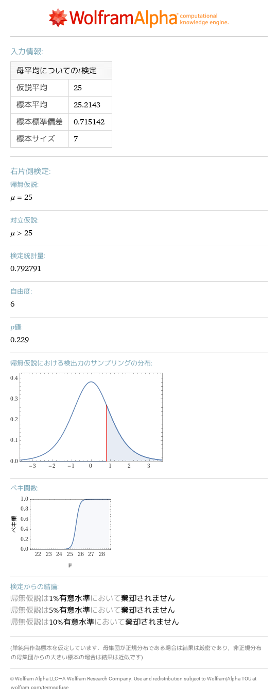

# 10 推測統計
- [test for binomial parameter p0=4/10,p\-hat=2/15,n=15](https://www.wolframalpha.com/input?i=test%20for%20binomial%20parameter%20p0%3D4%2F10%2Cp-hat%3D2%2F15%2Cn%3D15) 
- [X~normal distribution\(15\*4/10,sqrt\(15\*4/10\(1\-4/10\)\)\),P\(X<=2\)\*2](https://www.wolframalpha.com/input?i=X~normal%20distribution%2815%2A4%2F10%2Csqrt%2815%2A4%2F10%281-4%2F10%29%29%29%2CP%28X%3C%3D2%29%2A2) 
- [t\-test mu0=25,xbar=25\.21429,s=0\.7151423,n=7](https://www.wolframalpha.com/input?i=t-test%20mu0%3D25%2Cxbar%3D25.21429%2Cs%3D0.7151423%2Cn%3D7) 
- [t\-interval xbar=25\.21429,s=0\.7151423,n=7](https://www.wolframalpha.com/input?i=t-interval%20xbar%3D25.21429%2Cs%3D0.7151423%2Cn%3D7) 
