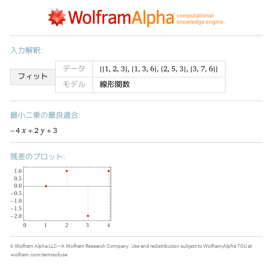

# 11 線形回帰分析
- [linear fit \{1,2,3\},\{1,3,6\},\{2,5,3\},\{3,7,6\}](https://www.wolframalpha.com/input?i=linear%20fit%20%7B1%2C2%2C3%7D%2C%7B1%2C3%2C6%7D%2C%7B2%2C5%2C3%7D%2C%7B3%2C7%2C6%7D) 
- [PseudoInverse\[\{\{1,1,2\},\{1,1,3\},\{1,2,5\},\{1,3,7\}\}\]\.\{3,6,3,6\}](https://www.wolframalpha.com/input?i=PseudoInverse%5B%7B%7B1%2C1%2C2%7D%2C%7B1%2C1%2C3%7D%2C%7B1%2C2%2C5%7D%2C%7B1%2C3%2C7%7D%7D%5D.%7B3%2C6%2C3%2C6%7D) ![PseudoInverse\[\{\{1,1,2\},\{1,1,3\},\{1,2,5\},\{1,3,7\}\}\]\.\{3,6,3,6\}](images/02.png)
