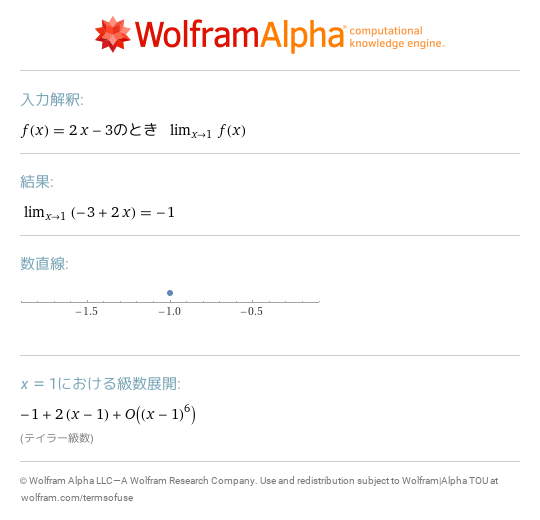
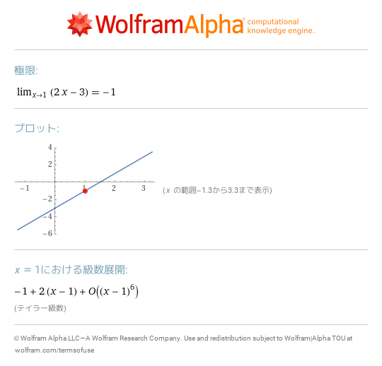
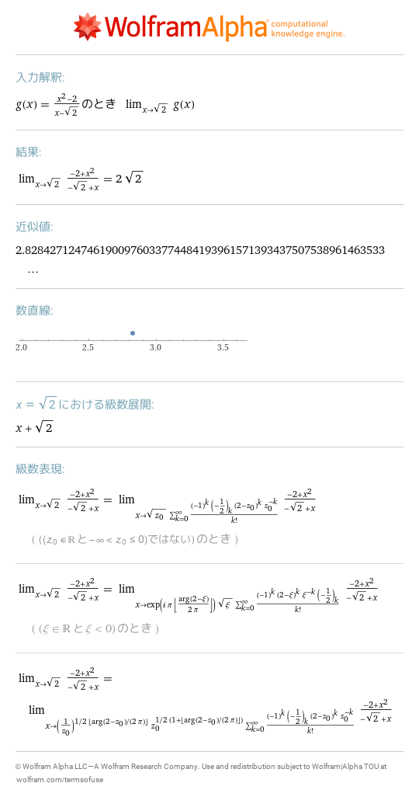
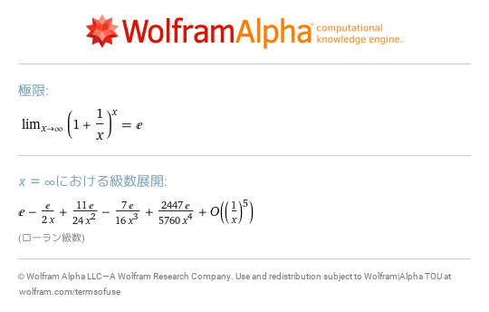
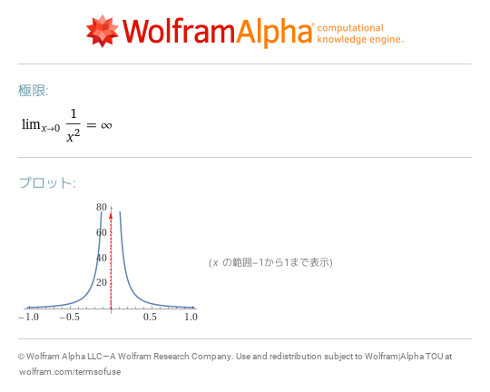
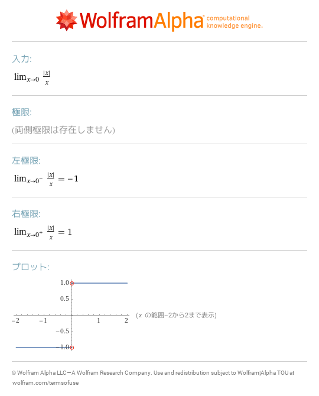

# 12 関数の極限と連続性
- [lim f\(x\) as x\->1 where f\(x\)=2x\-3](https://www.wolframalpha.com/input?i=lim%20f%28x%29%20as%20x-%3E1%20where%20f%28x%29%3D2x-3) 
- [lim 2x\-3 as x\->1](https://www.wolframalpha.com/input?i=lim%202x-3%20as%20x-%3E1) 
- [lim g\(x\) as x\->sqrt\(2\) where g\(x\)=\(x^2\-2\)/\(x\-sqrt\(2\)\)](https://www.wolframalpha.com/input?i=lim%20g%28x%29%20as%20x-%3Esqrt%282%29%20where%20g%28x%29%3D%28x%5E2-2%29%2F%28x-sqrt%282%29%29) 
- [limit \(1\+1/x\)^x as x\->infinity](https://www.wolframalpha.com/input?i=limit%20%281%2B1%2Fx%29%5Ex%20as%20x-%3Einfinity) 
- [limit 1/x^2 as x\->0](https://www.wolframalpha.com/input?i=limit%201%2Fx%5E2%20as%20x-%3E0) 
- [lim \|x\|/x as x\->0](https://www.wolframalpha.com/input?i=lim%20%7Cx%7C%2Fx%20as%20x-%3E0) 
