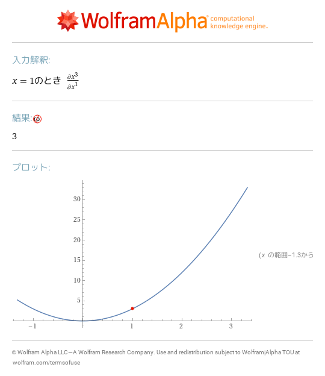
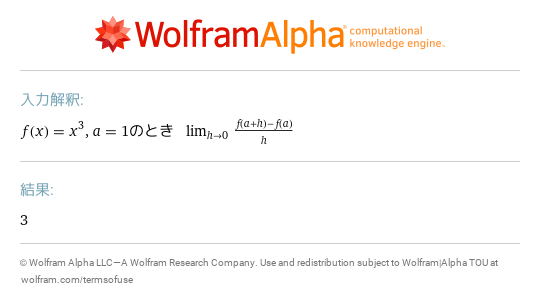
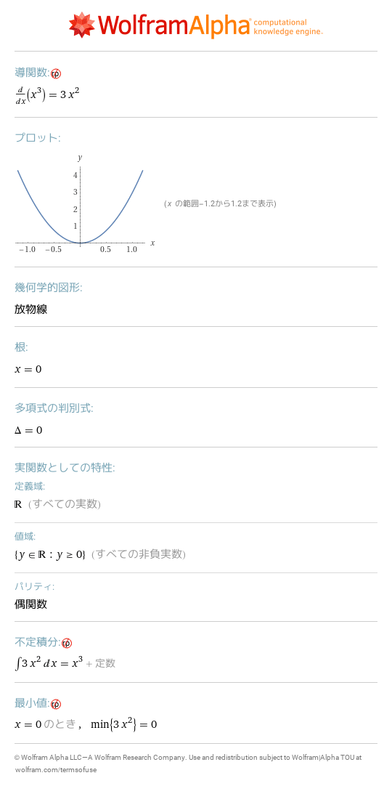
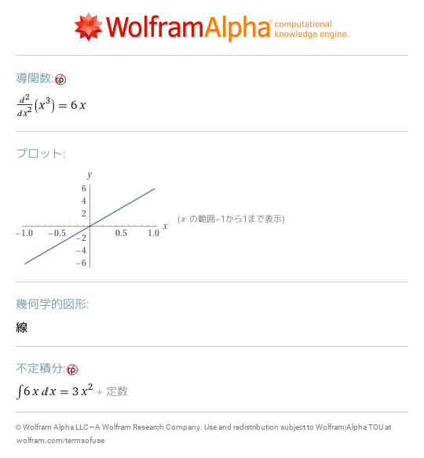
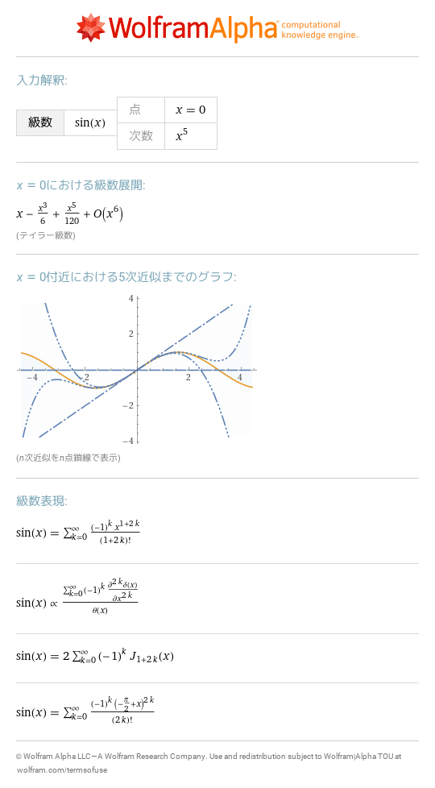
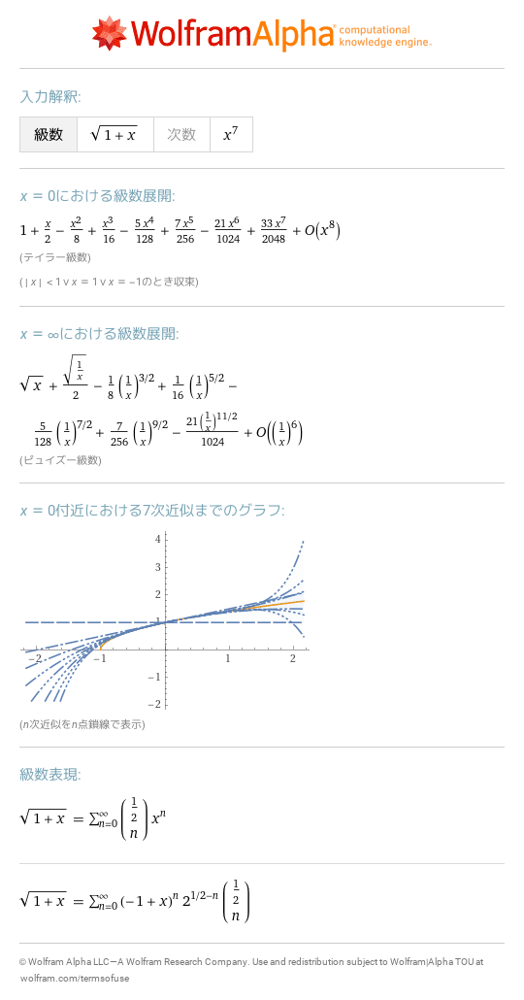
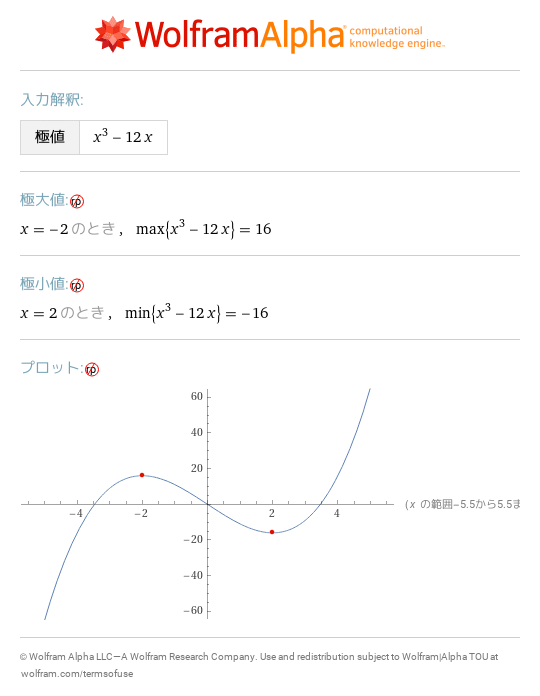

# 13 微分
- [f\(x\)=x^3,f'\(1\)](https://www.wolframalpha.com/input?i=f%28x%29%3Dx%5E3%2Cf%27%281%29) 
- [lim\_\(h\->0\) \(f\(a\+h\)\-f\(a\)\)/h where f\(x\)=x^3,a=1](https://www.wolframalpha.com/input?i=lim_%28h-%3E0%29%20%28f%28a%2Bh%29-f%28a%29%29%2Fh%20where%20f%28x%29%3Dx%5E3%2Ca%3D1) 
- [f\(x\)=x^3,f'\(x\)](https://www.wolframalpha.com/input?i=f%28x%29%3Dx%5E3%2Cf%27%28x%29) 
- [d^2/dx^2 x^3](https://www.wolframalpha.com/input?i=d%5E2%2Fdx%5E2%20x%5E3) 
- [series sin\(x\) at x=0 to order 5](https://www.wolframalpha.com/input?i=series%20sin%28x%29%20at%20x%3D0%20to%20order%205) 
- [series sqrt\(1\+x\) to order 7](https://www.wolframalpha.com/input?i=series%20sqrt%281%2Bx%29%20to%20order%207) 
- [local extrema of x^3\-12x](https://www.wolframalpha.com/input?i=local%20extrema%20of%20x%5E3-12x) 
