# 14 積分
- [int\_1^4 \(\-x^2\+4x\+1\)dx](https://www.wolframalpha.com/input?i=int_1%5E4%20%28-x%5E2%2B4x%2B1%29dx) 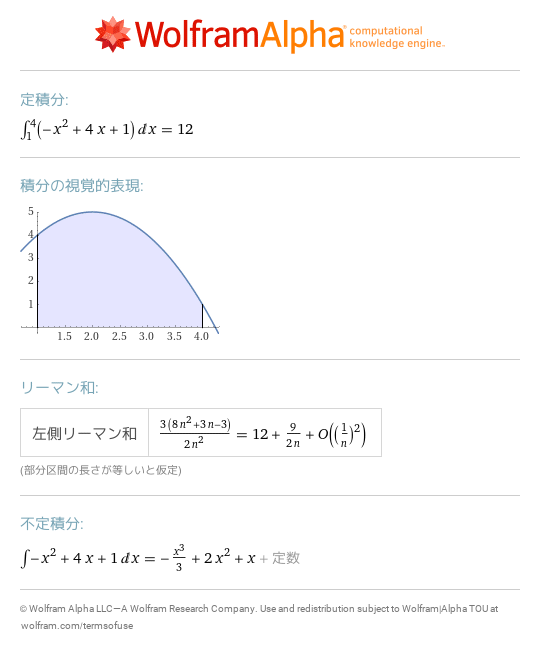
- [simplify int\_a^x \(\-t^2\+4t\+1\)dt](https://www.wolframalpha.com/input?i=simplify%20int_a%5Ex%20%28-t%5E2%2B4t%2B1%29dt) 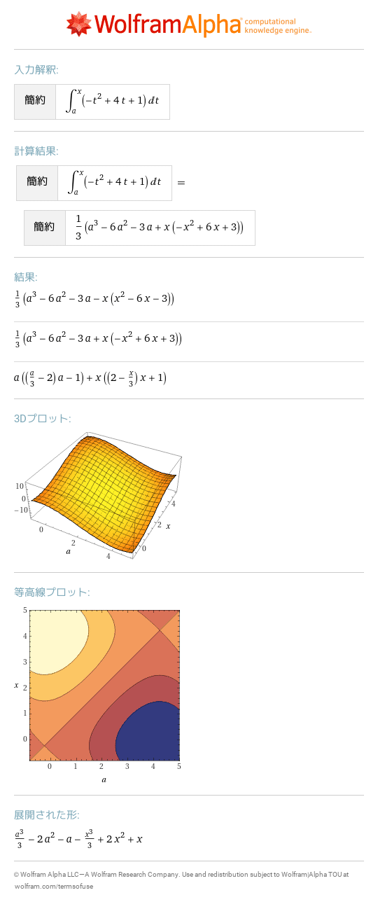
- [int \-x^2\+4x\+1 dx](https://www.wolframalpha.com/input?i=int%20-x%5E2%2B4x%2B1%20dx) 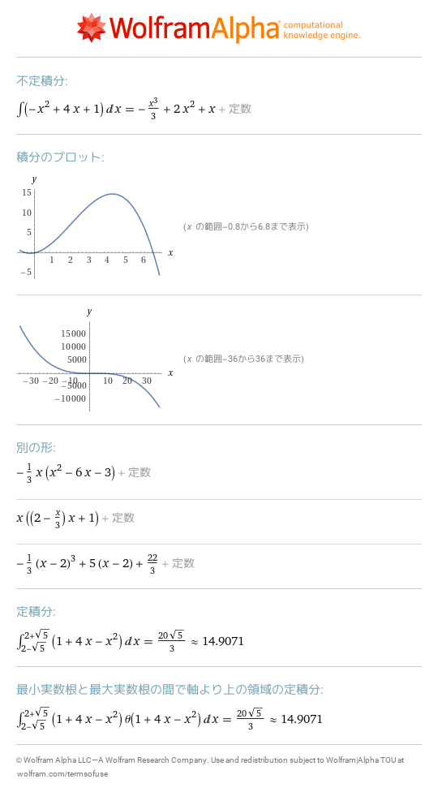
- [y'\(x\)=\-x^2\+4x\+1](https://www.wolframalpha.com/input?i=y%27%28x%29%3D-x%5E2%2B4x%2B1) 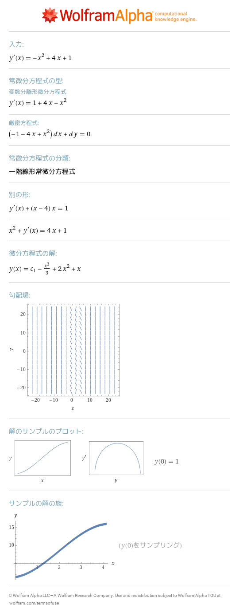
- [y'\(x\)=\-x^2\+4x\+1,y\(0\)=1](https://www.wolframalpha.com/input?i=y%27%28x%29%3D-x%5E2%2B4x%2B1%2Cy%280%29%3D1) 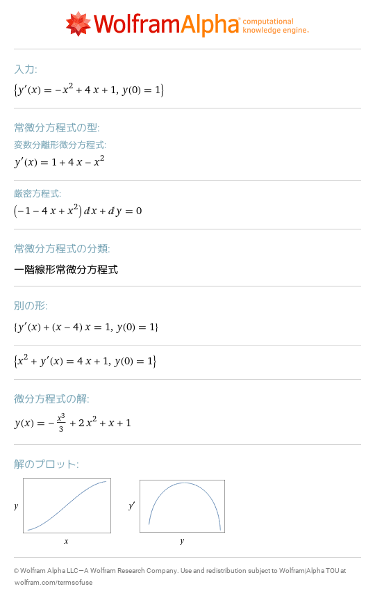
- [y'\(x\)=\-x y\(x\)](https://www.wolframalpha.com/input?i=y%27%28x%29%3D-x%20y%28x%29) 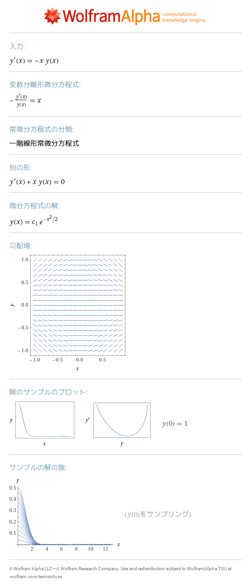
- [d/dx\(int\_a^x f\(t\)dt\)](https://www.wolframalpha.com/input?i=d%2Fdx%28int_a%5Ex%20f%28t%29dt%29) 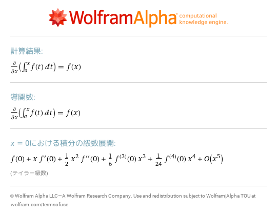
- [int\_0^\(pi/2\) log\(sin\(x\)\) dx](https://www.wolframalpha.com/input?i=int_0%5E%28pi%2F2%29%20log%28sin%28x%29%29%20dx) 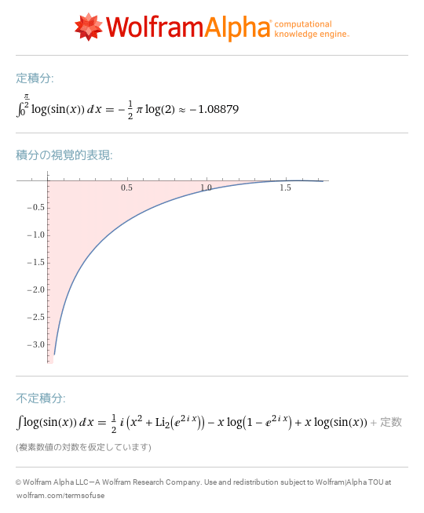
- [int \(p x\+q\)^100 dx](https://www.wolframalpha.com/input?i=int%20%28p%20x%2Bq%29%5E100%20dx) 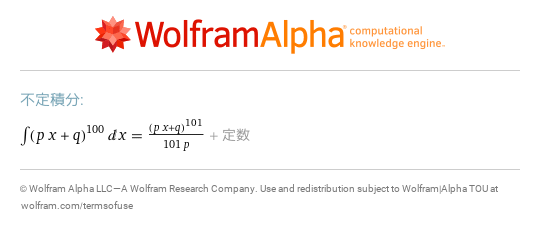
- [int 1/x^a x=0\.\.1](https://www.wolframalpha.com/input?i=int%201%2Fx%5Ea%20x%3D0..1) 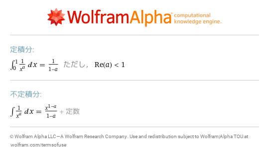
- [int 1/x^a x=1\.\.infinity](https://www.wolframalpha.com/input?i=int%201%2Fx%5Ea%20x%3D1..infinity) 
- [int exp\(\-x^2\) x=\-infinity\.\.infinity](https://www.wolframalpha.com/input?i=int%20exp%28-x%5E2%29%20x%3D-infinity..infinity) 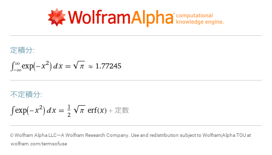
