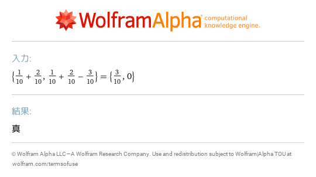
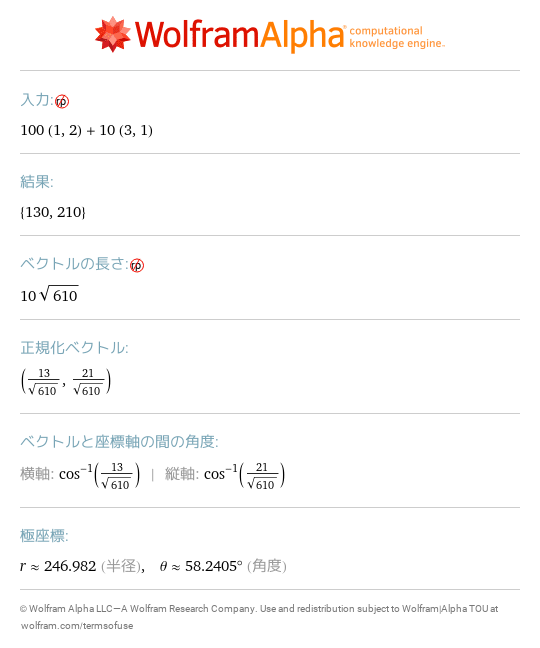
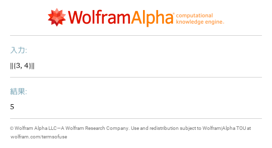
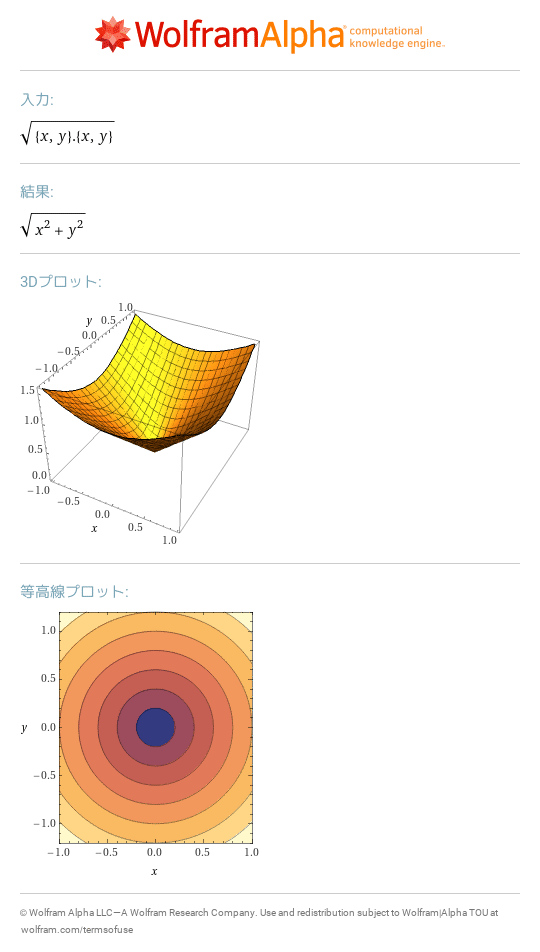
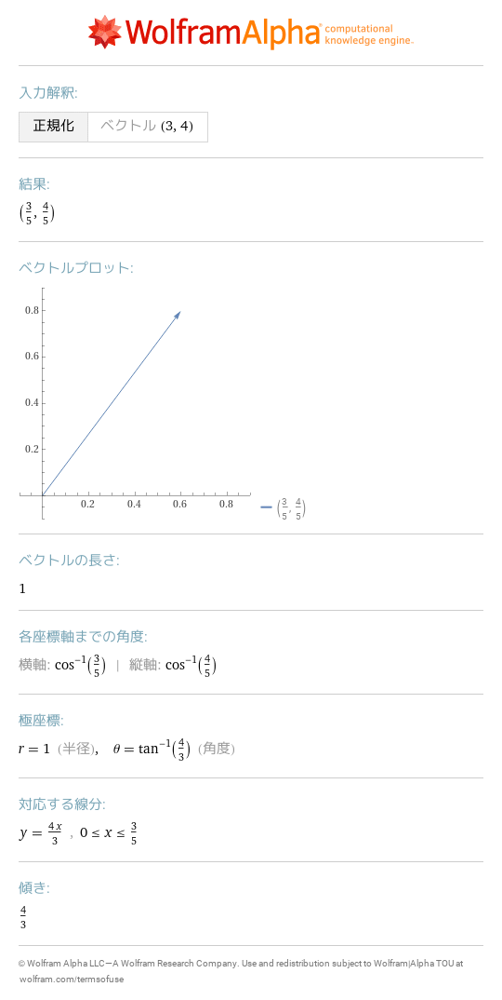
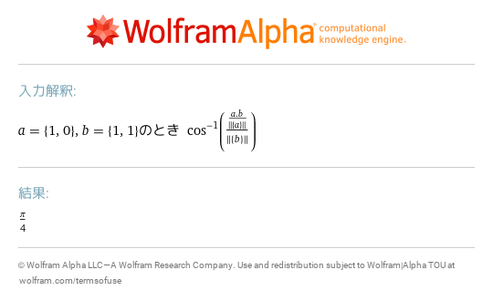
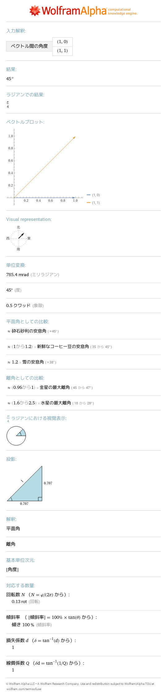

# 16 ベクトル
- [\{1/10\+2/10,1/10\+2/10\-3/10\}==\{3/10,0\}](https://www.wolframalpha.com/input?i=%7B1%2F10%2B2%2F10%2C1%2F10%2B2%2F10-3%2F10%7D%3D%3D%7B3%2F10%2C0%7D) 
- [100\{1,2\}\+10\{3,1\}](https://www.wolframalpha.com/input?i=100%7B1%2C2%7D%2B10%7B3%2C1%7D) 
- [norm \{3,4\}](https://www.wolframalpha.com/input?i=norm%20%7B3%2C4%7D) 
- [sqrt\(\{x,y\}\.\{x,y\}\)](https://www.wolframalpha.com/input?i=sqrt%28%7Bx%2Cy%7D.%7Bx%2Cy%7D%29) 
- [normalize \{3,4\}](https://www.wolframalpha.com/input?i=normalize%20%7B3%2C4%7D) 
- [arccos\(a\.b/norm\(a\)/norm\(b\)\) where a=\{1,0\},b=\{1,1\}](https://www.wolframalpha.com/input?i=arccos%28a.b%2Fnorm%28a%29%2Fnorm%28b%29%29%20where%20a%3D%7B1%2C0%7D%2Cb%3D%7B1%2C1%7D) 
- [vector angle \{1,0\},\{1,1\}](https://www.wolframalpha.com/input?i=vector%20angle%20%7B1%2C0%7D%2C%7B1%2C1%7D) 
