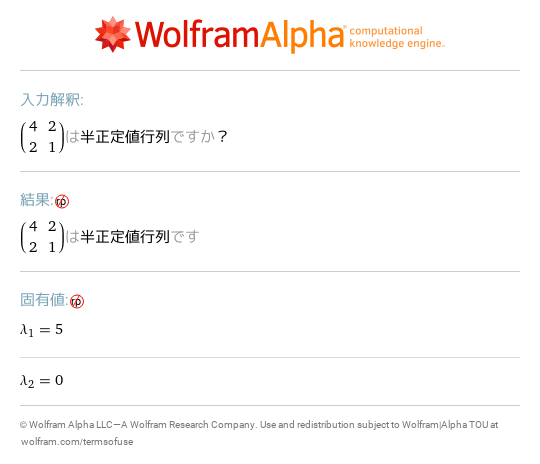

# 19 固有値と固有ベクトル
- [eigensystem \{\{5,6,3\},\{0,9,2\},\{0,6,8\}\}](https://www.wolframalpha.com/input?i=eigensystem%20%7B%7B5%2C6%2C3%7D%2C%7B0%2C9%2C2%7D%2C%7B0%2C6%2C8%7D%7D) 
- [solve det\(x IdentityMatrix\[3\]\-\{\{5,6,3\},\{0,9,2\},\{0,6,8\}\}\)=0](https://www.wolframalpha.com/input?i=solve%20det%28x%20IdentityMatrix%5B3%5D-%7B%7B5%2C6%2C3%7D%2C%7B0%2C9%2C2%7D%2C%7B0%2C6%2C8%7D%7D%29%3D0) ![solve det\(x IdentityMatrix\[3\]\-\{\{5,6,3\},\{0,9,2\},\{0,6,8\}\}\)=0](images/02.png)
- [null space of 5 IdentityMatrix\[3\]\-\{\{5,6,3\},\{0,9,2\},\{0,6,8\}\}](https://www.wolframalpha.com/input?i=null%20space%20of%205%20IdentityMatrix%5B3%5D-%7B%7B5%2C6%2C3%7D%2C%7B0%2C9%2C2%7D%2C%7B0%2C6%2C8%7D%7D) ![null space of 5 IdentityMatrix\[3\]\-\{\{5,6,3\},\{0,9,2\},\{0,6,8\}\}](images/03.png)
- [svd \{\{2,2,\-2\},\{2,5,\-4\},\{\-2,\-4,5\}\}](https://www.wolframalpha.com/input?i=svd%20%7B%7B2%2C2%2C-2%7D%2C%7B2%2C5%2C-4%7D%2C%7B-2%2C-4%2C5%7D%7D) 
- [positive semidefinite \{\{4,2\},\{2,1\}\}](https://www.wolframalpha.com/input?i=positive%20semidefinite%20%7B%7B4%2C2%7D%2C%7B2%2C1%7D%7D) 
