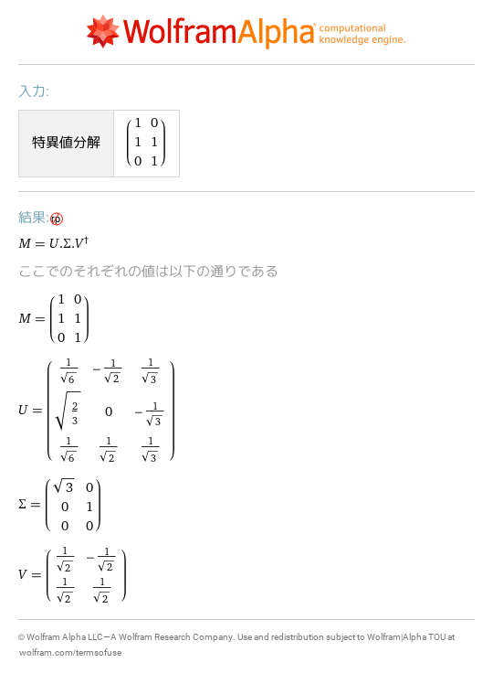
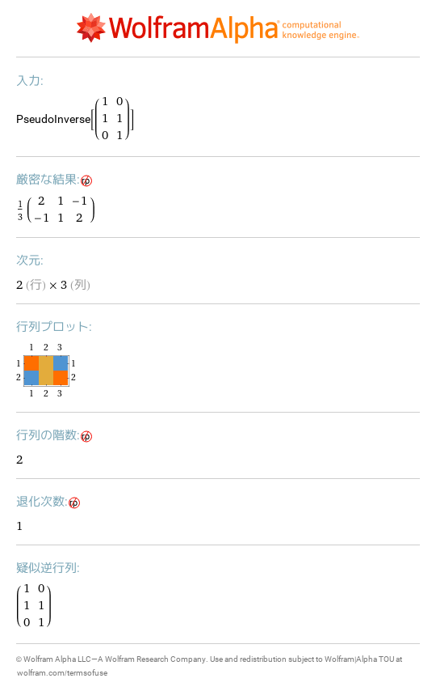
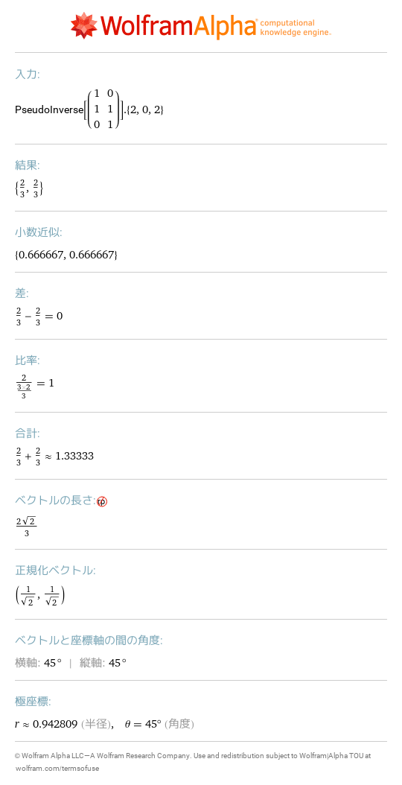

# 20 特異値分解と擬似逆行列
- [svd \{\{1,0\},\{1,1\},\{0,1\}\}](https://www.wolframalpha.com/input?i=svd%20%7B%7B1%2C0%7D%2C%7B1%2C1%7D%2C%7B0%2C1%7D%7D) 
- [pseudoinverse \{\{1,0\},\{1,1\},\{0,1\}\}](https://www.wolframalpha.com/input?i=pseudoinverse%20%7B%7B1%2C0%7D%2C%7B1%2C1%7D%2C%7B0%2C1%7D%7D) 
- [\(pseudoinverse \{\{1,0\},\{1,1\},\{0,1\}\}\)\.\{2,0,2\}](https://www.wolframalpha.com/input?i=%28pseudoinverse%20%7B%7B1%2C0%7D%2C%7B1%2C1%7D%2C%7B0%2C1%7D%7D%29.%7B2%2C0%2C2%7D) 
