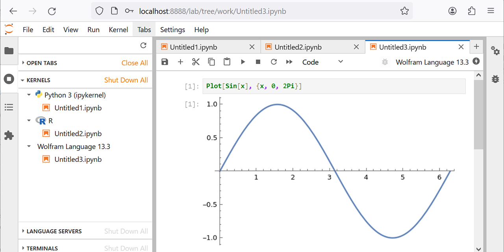

# Jupyter LabのためのDockerコンテナ

Dockerが動作する環境を前提とします．

注意：macOSでも動作を確認していますが，2024年4月の時点で，Dockerイメージwolframresearch/wolframengineのプラットフォームがlinux/amd64だけでなので，性能は悪いかもしれません．

## 目標（使い方）

Python, R, Wolfram言語が使えるJupyter Labを，Dockerコンテナで提供します．

準備（後述）が終わると，コンテナを次のように構築できます（`pass`はパスワード（変更可）．Ctrl-Cで終了）．

```bash
docker run --rm -it -v $(pwd):/home/wolframengine/work -e PASS=pass -p 8888:8888 comath
```

ブラウザでhttp://localhost:8888 にアクセスすると，Jupyter Labが使えます（計算が途中で止まったようにみえるときは，Kernel→Restart Kernel）．



/home/wolframengine/work に保存したファイルはホストに保存されます．

## 準備

### Wolfram Engineの有効化

Wolfram IDがない場合は https://account.wolfram.com/login/create で作ってから先に進みます．

Wolfram Engineを有効化して，Licensing/mathpassを作ります．そのために，適当な作業ディレクトリで，次を実行します．

```bash
mkdir Licensing
docker pull wolframresearch/wolframengine
docker run -it wolframresearch/wolframengine
```

Wolfram IDとパスワードを入力するとWolfram Engineが有効化されます（参考：https://hub.docker.com/r/wolframresearch/wolframengine ）．

```
> docker run -it wolframresearch/wolframengine
The Wolfram Engine requires one-time activation on this computer.

Visit https://wolfram.com/developer-license to get your free license.

Wolfram ID: yourwolframid@example.com
Password:
Wolfram Engine activated. See https://www.wolfram.com/wolframscript/ for more information.
Wolfram Language 12.2.0 Engine for Linux x86 (64-bit)
Copyright 1988-2020 Wolfram Research, Inc.

In[1]:= $PasswordFile

Out[1]= /home/wolframengine/.WolframEngine/Licensing/mathpass

In[2]:= $PasswordFile // FilePrint
1e1d781ed0a3    6520-03713-97466        4304-2718-2K5ATR        5095-179-696:2,0,8,8:80001:20190627

In[3]:= Quit
```

テキストファイルLicensing/mathpassを作り，`In[2]`の結果，上の例では`1e1d...627`を貼り付けて保存します．

ディレクトリ構造は次のとおりです．

```
.
└── Licensing
    └── mathpass
```

Wolfram Engineの動作を確認します（`Quit`で終了）．

```bash
docker run --rm -it -v ./Licensing:/usr/share/WolframEngine/Licensing wolframresearch/wolframengine
```

### イメージ構築

Python, R, Wolfram Engineを使えるJupyter LabのDockerイメージを構築します（[Dockerfile](Dockerfile)）．

```bash
docker pull curlimages/curl
docker run --rm curlimages/curl https://raw.githubusercontent.com/taroyabuki/comath/main/docker/Dockerfile \
| docker build -t comath -f- .
```
